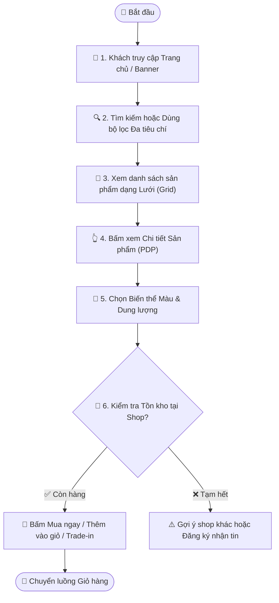

# Quy trình Nghiệp vụ: Khám phá & Tìm kiếm Sản phẩm

> **Mã quy trình:** Flow 01  
> **Mức độ phức tạp:** 1/5 (Đơn giản)  
> **Trọng tâm:** Khách hàng duyệt trang chủ, sử dụng bộ lọc đa tiêu chí, tìm kiếm thông minh và xem chi tiết sản phẩm cùng tồn kho cửa hàng.  

---

## 1. Mục tiêu Quy trình
Giúp khách hàng dễ dàng tìm đúng mẫu điện thoại theo nhu cầu, xem thông số, giá bán và kiểm tra tình trạng còn hàng tại từng chi nhánh mà không cần đăng nhập.

## Sơ đồ Quy trình Trực quan (Flowchart)

## 2. Các Bên Tham gia (Actors)
- **Khách hàng (Guest / Member)**
- **Website PhoneX**
- **Cơ sở dữ liệu tập trung**

## 3. Điều kiện Tiên quyết (Pre-conditions)
Hệ thống đã có danh mục sản phẩm, biến thể màu/dung lượng và cấu hình tồn kho theo cửa hàng.

---

## 4. Các Bước Thực hiện Chi tiết

### Bước 01: Truy cập Trang chủ & Xem gợi ý
- **Chủ thể thực hiện:** `Khách hàng`
- **Hành động nghiệp vụ:** Khách mở trang chủ, xem Banner sự kiện, Flash Sale, danh mục thương hiệu (Apple, Samsung, Xiaomi...) và danh mục điện thoại cũ tuyển chọn.
- **Phản hồi hệ thống:** Website hiển thị dữ liệu banner, giá khuyến mãi và danh sách nổi bật được cấu hình từ CMS.

### Bước 02: Tìm kiếm & Sử dụng Bộ lọc Đa tiêu chí
- **Chủ thể thực hiện:** `Khách hàng`
- **Hành động nghiệp vụ:** Gõ tên máy trên thanh tìm kiếm (có gợi ý nhanh Auto-suggest) hoặc dùng bộ lọc: Hãng, Dòng máy, Mức giá, Dung lượng (128GB/256GB), RAM, Tình trạng (Mới 100% / Like New 99%), Còn hàng.
- **Phản hồi hệ thống:** Hệ thống truy vấn cơ sở dữ liệu và phản hồi danh sách dạng lưới (Grid) ngay lập tức theo bộ lọc đã chọn.

### Bước 03: Xem Product Card & So sánh nhanh
- **Chủ thể thực hiện:** `Khách hàng`
- **Hành động nghiệp vụ:** Xem ảnh đại diện, giá niêm yết, % giảm giá, ưu đãi quà tặng và nhãn tình trạng kho. Khách có thể bấm nút Yêu thích hoặc Thêm vào danh sách so sánh.
- **Phản hồi hệ thống:** Lưu tạm sản phẩm vào bộ nhớ máy (Local Storage) mà không cần bắt buộc đăng nhập.

### Bước 04: Xem Trang Chi tiết Sản phẩm (PDP)
- **Chủ thể thực hiện:** `Khách hàng`
- **Hành động nghiệp vụ:** Xem bộ sưu tập ảnh HD, chọn phiên bản dung lượng/màu sắc để cập nhật giá tiền tương ứng theo thời gian thực.
- **Phản hồi hệ thống:** Tự động đổi giá bán, ảnh đại diện và trạng thái tồn kho theo đúng phiên bản biến thể khách vừa chọn.

### Bước 05: Kiểm tra Tồn kho tại Cửa hàng gần nhất
- **Chủ thể thực hiện:** `Khách hàng`
- **Hành động nghiệp vụ:** Khách chọn Tỉnh/Thành và Quận/Huyện để kiểm tra xem chi nhánh nào còn màu và phiên bản mình muốn mua.
- **Phản hồi hệ thống:** Website truy vấn số lượng thực tế tại từng chi nhánh từ Hệ thống quản trị kho CRM.

### Bước 06: Lựa chọn Hành động Tiếp theo (CTA)
- **Chủ thể thực hiện:** `Khách hàng`
- **Hành động nghiệp vụ:** Khách chọn 1 trong 3 hành động: [Mua ngay] ➔ Chuyển thẳng Checkout; [Thêm vào giỏ] ➔ Tiếp tục mua sắm; hoặc [Thu cũ đổi mới] ➔ Chuyển luồng Trade-in.
- **Phản hồi hệ thống:** Chuyển tiếp trạng thái và thông tin sản phẩm vào giỏ hàng hoặc luồng Trade-in.

---

## 5. Dữ liệu Liên thông Website ↔ CRM
Website đọc trực tiếp danh mục sản phẩm, biến thể, bảng giá bán và số lượng tồn kho theo chi nhánh từ cơ sở dữ liệu chung của CRM.

## 6. Xử lý Tình huống Ngoại lệ (Edge Cases)
- **❓ Nếu phiên bản màu khách chọn đã hết hàng?**
  - 👉 *Giải pháp:* Nút 'Mua ngay' chuyển sang 'Tạm hết hàng' hoặc 'Nhận thông báo khi có hàng', đồng thời hiển thị danh sách các chi nhánh khác còn hàng.
- **❓ Khách không có mạng ổn định?**
  - 👉 *Giải pháp:* Giao diện tối ưu ảnh WebP nhẹ, giữ trạng thái lọc đã chọn mà không tải lại toàn trang.
