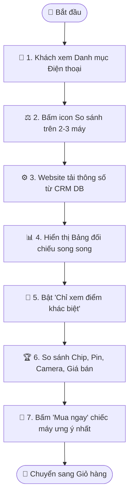

# Quy trình Nghiệp vụ: So sánh Điện thoại Song song

> **Mã quy trình:** Flow 02  
> **Mức độ phức tạp:** 1/5 (Đơn giản)  
> **Trọng tâm:** Khách hàng chọn 2 đến 3 mẫu điện thoại để đặt cạnh nhau, làm nổi bật các điểm khác biệt về cấu hình, pin, camera và giá cả.  

---

## 1. Mục tiêu Quy trình
Hỗ trợ khách hàng phân vân giữa nhiều mẫu máy dễ dàng ra quyết định mua sắm thông qua bảng đối chiếu thông số trực quan.

## Sơ đồ Quy trình Trực quan (Flowchart)

## 2. Các Bên Tham gia (Actors)
- **Khách hàng**
- **Website PhoneX**

## 3. Điều kiện Tiên quyết (Pre-conditions)
Các sản phẩm trong cơ sở dữ liệu đã được nhập đầy đủ bảng thông số kỹ thuật chuẩn hóa.

---

## 4. Các Bước Thực hiện Chi tiết

### Bước 01: Thêm Sản phẩm vào Danh sách So sánh
- **Chủ thể thực hiện:** `Khách hàng`
- **Hành động nghiệp vụ:** Từ trang danh mục hoặc trang chi tiết, khách bấm icon 'So sánh' trên Product Card của 2 hoặc 3 chiếc điện thoại muốn đối chiếu.
- **Phản hồi hệ thống:** Thanh dock so sánh ghim ở góc dưới màn hình hiển thị thumbnail các máy đã chọn kèm nút 'So sánh ngay'.

### Bước 02: Xem Bảng So sánh Trực quan
- **Chủ thể thực hiện:** `Khách hàng`
- **Hành động nghiệp vụ:** Khách mở trang so sánh: hiển thị bảng chia cột song song gồm Ảnh, Giá bán, Màn hình, Vi xử lý (Chip), RAM, Bộ nhớ trong, Cụm Camera, Pin & Công nghệ sạc, Trọng lượng và Chế độ bảo hành.
- **Phản hồi hệ thống:** Tự động căn chỉnh các tiêu chí ngang hàng nhau để người dùng dễ quan sát bằng mắt thường.

### Bước 03: Bật chế độ 'Chỉ xem điểm khác biệt'
- **Chủ thể thực hiện:** `Khách hàng`
- **Hành động nghiệp vụ:** Khách gạt công tắc 'Chỉ hiển thị điểm khác nhau' để ẩn đi những thông số giống nhau và tô màu nổi bật thông số vượt trội (ví dụ: máy A pin 5000mAh vs máy B pin 4500mAh).
- **Phản hồi hệ thống:** Bộ lọc DOM ẩn các dòng có giá trị tương đồng, làm sáng rõ điểm mạnh của từng máy.

### Bước 04: Chọn mua chiếc máy ưng ý nhất
- **Chủ thể thực hiện:** `Khách hàng`
- **Hành động nghiệp vụ:** Dưới mỗi cột sản phẩm đều có nút [Chọn mua] hoặc [Thu cũ đổi mới]. Khách bấm nút để chuyển ngay đến luồng mua sắm.
- **Phản hồi hệ thống:** Lưu sản phẩm được chọn và chuyển hướng khách hàng vào Giỏ hàng.

---

## 5. Dữ liệu Liên thông Website ↔ CRM
Bảng thông số kỹ thuật (Specs) đồng nhất từ kho dữ liệu sản phẩm trung tâm của CRM.

## 6. Xử lý Tình huống Ngoại lệ (Edge Cases)
- **❓ So sánh 2 máy khác hệ điều hành (iOS vs Android)?**
  - 👉 *Giải pháp:* Hệ thống chuẩn hóa các mục tương ứng (A17 Pro vs Snapdragon 8 Gen 3) để người dùng dễ hình dung phân khúc tương đương.
- **❓ Một trong các máy đã ngừng kinh doanh?**
  - 👉 *Giải pháp:* Ghi chú nhãn 'Ngừng kinh doanh' và gợi ý phiên bản đời mới hơn để so sánh thay thế.
