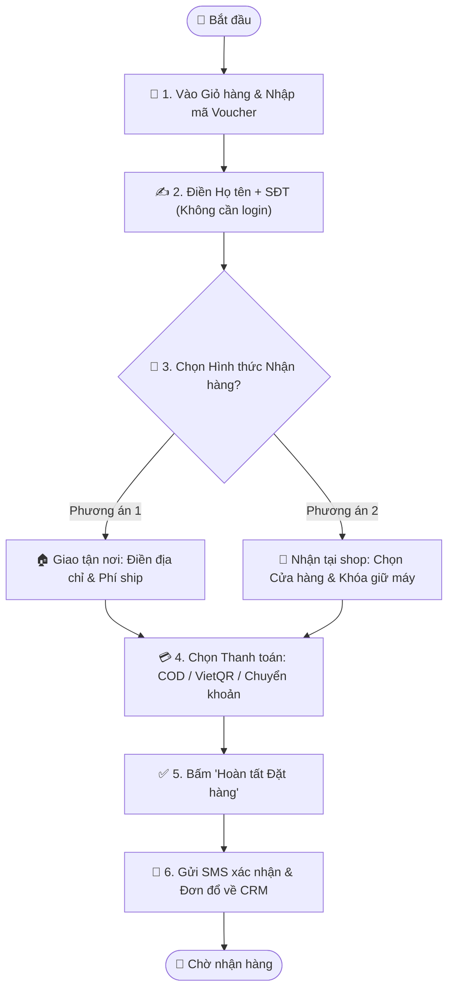

# Quy trình Nghiệp vụ: Mua hàng & Đặt hàng Nhanh (Click & Collect)

> **Mã quy trình:** Flow 03  
> **Mức độ phức tạp:** 2/5 (Trung bình)  
> **Trọng tâm:** Khách hàng đặt mua điện thoại không cần tài khoản, lựa chọn nhận hàng tận nhà hoặc đến lấy tại cửa hàng (Click & Collect).  

---

## 1. Mục tiêu Quy trình
Tối ưu hóa tỷ lệ chuyển đổi đơn hàng với quy trình thanh toán ngắn gọn nhất, không ép đăng nhập và minh bạch chi phí.

## Sơ đồ Quy trình Trực quan (Flowchart)

## 2. Các Bên Tham gia (Actors)
- **Khách hàng (Guest / Member)**
- **Website PhoneX**
- **Hệ thống CRM**

## 3. Điều kiện Tiên quyết (Pre-conditions)
Sản phẩm còn tồn kho và bảng giá niêm yết đang có hiệu lực.

---

## 4. Các Bước Thực hiện Chi tiết

### Bước 01: Kiểm tra Giỏ hàng & Nhập mã Ưu đãi
- **Chủ thể thực hiện:** `Khách hàng`
- **Hành động nghiệp vụ:** Khách xem lại danh sách máy, màu sắc, số lượng, quà tặng đi kèm. Nhập mã voucher khuyến mãi nếu có.
- **Phản hồi hệ thống:** Tính toán tự động: Tiền hàng − Giảm giá voucher = Tạm tính.

### Bước 02: Điền Thông tin Người nhận (Không ép đăng nhập)
- **Chủ thể thực hiện:** `Khách hàng`
- **Hành động nghiệp vụ:** Khách chỉ cần điền Họ tên, Số điện thoại và Ghi chú giao hàng. Hệ thống không bắt buộc tạo mật khẩu hay đăng nhập.
- **Phản hồi hệ thống:** Xác thực định dạng số điện thoại Việt Nam hợp lệ; tự động lưu thông tin khách hàng vào CRM.

### Bước 03: Chọn Hình thức Nhận hàng
- **Chủ thể thực hiện:** `Khách hàng`
- **Hành động nghiệp vụ:** Khách chọn 1 trong 2 hình thức:
- Phương án A: Giao hàng tận nơi (Điền địa chỉ nhà, tính phí vận chuyển).
- Phương án B: Nhận tại cửa hàng (Click & Collect - Chọn chi nhánh gần nhất để đặt giữ máy).
- **Phản hồi hệ thống:** Nếu chọn Click & Collect, hệ thống kiểm tra tồn kho tại chi nhánh đó và kích hoạt cơ chế tạm khóa (giữ chỗ) máy.

### Bước 04: Chọn Phương thức Thanh toán & Xác nhận
- **Chủ thể thực hiện:** `Khách hàng`
- **Hành động nghiệp vụ:** Chọn Thanh toán khi nhận hàng (COD), Chuyển khoản ngân hàng hoặc Quét mã VietQR. Kiểm tra tổng số tiền thanh toán cuối cùng và bấm [Hoàn tất Đặt hàng].
- **Phản hồi hệ thống:** Tạo mã đơn hàng (VD: PX-88392), chuyển trạng thái đơn sang 'Đã tiếp nhận' và đồng bộ sang CRM.

### Bước 05: Nhận Thông báo Đặt hàng Thành công
- **Chủ thể thực hiện:** `Khách hàng`
- **Hành động nghiệp vụ:** Màn hình hiển thị thông tin tóm tắt đơn hàng, mã đơn, hướng dẫn nhận hàng và số hotline hỗ trợ.
- **Phản hồi hệ thống:** Gửi SMS / Zalo ZNS xác nhận đến số điện thoại của khách kèm liên kết tra cứu đơn.

---

## 5. Dữ liệu Liên thông Website ↔ CRM
Đơn hàng mới tạo lập tức xuất hiện trên CRM Dashboard của chi nhánh tiếp nhận. Tồn kho sản phẩm được cập nhật trạng thái 'Đang giữ chỗ'.

## 6. Xử lý Tình huống Ngoại lệ (Edge Cases)
- **❓ Khách đặt Click & Collect nhưng sau 24h không đến lấy?**
  - 👉 *Giải pháp:* CRM tự động chuyển trạng thái đơn thành 'Quá hạn giữ máy', nhả số lượng tồn kho về trạng thái 'Sẵn sàng bán' cho khách khác.
- **❓ Số điện thoại khách nhập sai định dạng?**
  - 👉 *Giải pháp:* Giao diện báo đỏ ngay tại ô nhập liệu, ngăn không cho bấm đặt hàng cho đến khi sửa đúng.
