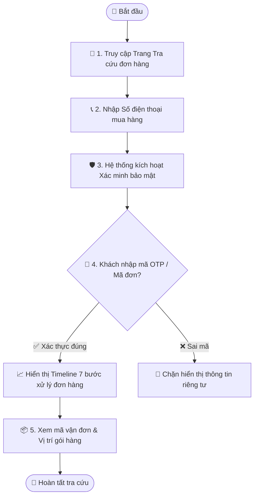

# Quy trình Nghiệp vụ: Tra cứu Đơn hàng & Bảo mật Dữ liệu

> **Mã quy trình:** Flow 04  
> **Mức độ phức tạp:** 2/5 (Trung bình)  
> **Trọng tâm:** Khách hàng tra cứu lộ trình vận chuyển và trạng thái xử lý đơn hàng bằng Số điện thoại kết hợp xác minh bảo mật.  

---

## 1. Mục tiêu Quy trình
Giúp người mua theo dõi tiến độ đơn hàng minh bạch nhưng vẫn bảo vệ tuyệt đối thông tin riêng tư (địa chỉ, giá tiền, số điện thoại) của khách hàng.

## Sơ đồ Quy trình Trực quan (Flowchart)

## 2. Các Bên Tham gia (Actors)
- **Khách hàng**
- **Website PhoneX**
- **Cổng xác thực OTP / Mã đơn**
- **Hệ thống CRM**

## 3. Điều kiện Tiên quyết (Pre-conditions)
Khách hàng đã có ít nhất một đơn hàng đã tạo trong hệ thống PhoneX.

---

## 4. Các Bước Thực hiện Chi tiết

### Bước 01: Nhập Số Điện Thoại Tra cứu
- **Chủ thể thực hiện:** `Khách hàng`
- **Hành động nghiệp vụ:** Khách truy cập mục 'Tra cứu đơn hàng' trên thanh điều hướng, nhập số điện thoại đã dùng khi mua hàng.
- **Phản hồi hệ thống:** Hệ thống kiểm tra số điện thoại trong cơ sở dữ liệu đơn hàng.

### Bước 02: Xác minh Bảo mật Danh tính
- **Chủ thể thực hiện:** `Khách hàng`
- **Hành động nghiệp vụ:** Hệ thống yêu cầu khách nhập Mã xác thực (OTP gửi về SMS hoặc 4 số cuối của Mã đơn hàng).
- **Phản hồi hệ thống:** Ngăn chặn hành vi kẻ xấu dò số điện thoại của người khác để xem trộm địa chỉ nhà và sản phẩm đã mua.

### Bước 03: Xem Tiến trình Đơn hàng Trực quan (Timeline)
- **Chủ thể thực hiện:** `Khách hàng`
- **Hành động nghiệp vụ:** Hiển thị thanh tiến trình 7 trạng thái: Đã tiếp nhận ➔ Đã xác nhận ➔ Đang chuẩn bị hàng ➔ Đang giao hàng ➔ Đã giao ➔ Hoàn tất (hoặc Đã hủy).
- **Phản hồi hệ thống:** Trích xuất dữ liệu trạng thái mới nhất được cập nhật từ CRM của nhân viên bán hàng/giao vận.

### Bước 04: Xem Chi tiết Đơn & Thao tác Bổ sung
- **Chủ thể thực hiện:** `Khách hàng`
- **Hành động nghiệp vụ:** Xem danh sách máy, đơn vị vận chuyển, mã vận đơn (tracking code), vị trí cửa hàng hẹn lấy. Khách có thể bấm [Hủy đơn] nếu đơn đang ở trạng thái 'Đã tiếp nhận'.
- **Phản hồi hệ thống:** Nếu khách bấm Hủy đơn, gửi thông báo cảnh báo đến nhân viên phụ trách trên CRM để dừng đóng gói.

---

## 5. Dữ liệu Liên thông Website ↔ CRM
Trạng thái đơn hàng trên Website phản ánh 100% dữ liệu thao tác của nhân viên kho và giao vận trên phần mềm CRM.

## 6. Xử lý Tình huống Ngoại lệ (Edge Cases)
- **❓ Số điện thoại có nhiều đơn hàng khác nhau?**
  - 👉 *Giải pháp:* Hiển thị danh sách tất cả các đơn của số điện thoại đó, sắp xếp theo thời gian mới nhất đến cũ nhất.
- **❓ Khách nhập sai OTP quá 3 lần?**
  - 👉 *Giải pháp:* Khóa tra cứu tạm thời trong 5 phút để chống tấn công brute-force.
