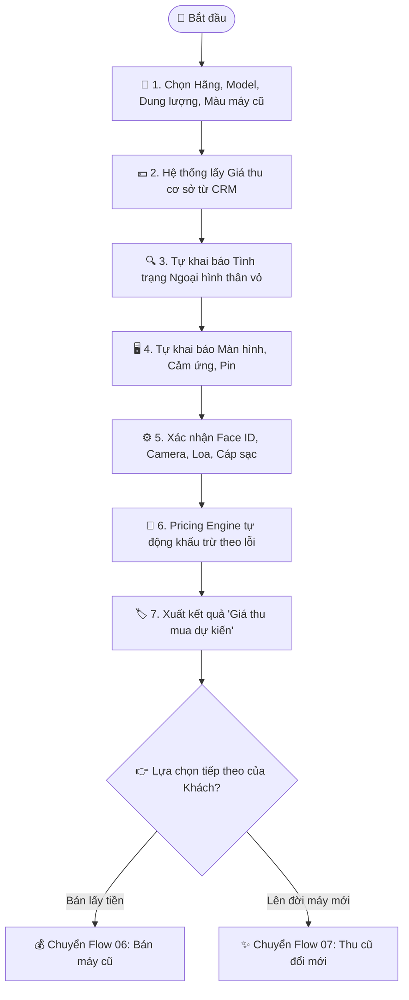

# Quy trình Nghiệp vụ: Định giá Máy cũ Trực tuyến (Valuation Engine)

> **Mã quy trình:** Flow 05  
> **Mức độ phức tạp:** 2/5 (Trung bình)  
> **Trọng tâm:** Khách hàng tự kiểm tra giá thu mua chiếc điện thoại cũ của mình thông qua bộ câu hỏi thẩm định 11 bước nhanh chóng.  

---

## 1. Mục tiêu Quy trình
Cung cấp mức giá thu mua dự kiến minh bạch, giúp khách hàng biết trước giá trị máy trước khi quyết định bán hoặc đổi máy mới.

## Sơ đồ Quy trình Trực quan (Flowchart)

## 2. Các Bên Tham gia (Actors)
- **Khách hàng**
- **Website PhoneX**
- **Động cơ Bảng giá Thu mua (Pricing Engine)**

## 3. Điều kiện Tiên quyết (Pre-conditions)
Hệ thống CRM đã ban hành Bảng giá thu cơ sở và Quy tắc khấu trừ lỗi cho từng dòng máy.

---

## 4. Các Bước Thực hiện Chi tiết

### Bước 01: Chọn Định danh Dòng máy Cũ
- **Chủ thể thực hiện:** `Khách hàng`
- **Hành động nghiệp vụ:** Khách chọn: Thương hiệu (VD: Apple) ➔ Model máy (VD: iPhone 13 Pro Max) ➔ Dung lượng (VD: 128GB) ➔ Màu sắc.
- **Phản hồi hệ thống:** Hệ thống lấy 'Giá thu cơ sở' (Base Price) của dòng máy đó từ cơ sở dữ liệu.

### Bước 02: Tự đánh giá Ngoại hình Thân vỏ
- **Chủ thể thực hiện:** `Khách hàng`
- **Hành động nghiệp vụ:** Khách chọn tình trạng vỏ: Loại 1 (Đẹp như mới, không trầy) / Loại 2 (Trầy xước nhẹ) / Loại 3 (Cấn móp, trầy sâu).
- **Phản hồi hệ thống:** Áp dụng tỷ lệ trừ tiền tương ứng theo bảng quy tắc thẩm định.

### Bước 03: Đánh giá Màn hình & Hiển thị
- **Chủ thể thực hiện:** `Khách hàng`
- **Hành động nghiệp vụ:** Chọn tình trạng: Màn hình zin đẹp không xước / Màn hình trầy nhẹ / Màn hình ám màu, đốm / Màn hình sọc, chảy mực, vỡ kính.
- **Phản hồi hệ thống:** Khấu trừ chi phí thay thế hoặc ép kính màn hình theo ma trận định giá.

### Bước 04: Đánh giá Tình trạng Pin & Chức năng
- **Chủ thể thực hiện:** `Khách hàng`
- **Hành động nghiệp vụ:** Nhập % dung lượng pin còn lại (Pin trên 85% / Pin bảo trì) và xác nhận Face ID/Vân tay, Camera, Loa, Mic hoạt động bình thường hay có lỗi.
- **Phản hồi hệ thống:** Trừ tiền tương ứng với các chức năng bị hỏng hoặc linh kiện cần thay thế.

### Bước 05: Xác nhận Phụ kiện & Xuất xứ
- **Chủ thể thực hiện:** `Khách hàng`
- **Hành động nghiệp vụ:** Máy chính hãng VN/A hay xách tay? Còn hộp và cáp sạc zin không? (Có phụ kiện có thể được cộng thêm ưu đãi).
- **Phản hồi hệ thống:** Tính toán số tiền cuối cùng bằng thuật toán định giá.

### Bước 06: Nhận Kết quả Định giá & Chọn Hướng đi
- **Chủ thể thực hiện:** `Khách hàng`
- **Hành động nghiệp vụ:** Hiển thị 'Giá thu mua dự kiến' kèm lưu ý mức giá có thể điều chỉnh sau khi kỹ thuật viên kiểm tra trực tiếp. Khách chọn: [Bán máy lấy tiền] hoặc [Thu cũ đổi mới].
- **Phản hồi hệ thống:** Lưu mã kết quả định giá tạm thời để tái sử dụng sang bước tiếp theo.

---

## 5. Dữ liệu Liên thông Website ↔ CRM
Công thức tính và bảng giá đồng bộ trực tiếp từ phân hệ CRM Pricing Engine của phòng Kinh doanh.

## 6. Xử lý Tình huống Ngoại lệ (Edge Cases)
- **❓ Máy bị hỏng nguồn không lên màn hình?**
  - 👉 *Giải pháp:* Gợi ý khách mang trực tiếp đến trung tâm kỹ thuật để bóc máy kiểm tra linh kiện còn dùng được.
- **❓ Giá thu thực tế có khác giá online không?**
  - 👉 *Giải pháp:* Hệ thống có dòng cảnh báo minh bạch: Giá online là tham khảo dựa trên tự khai báo, giá chốt căn cứ vào thẩm định thực tế của kỹ thuật viên.
