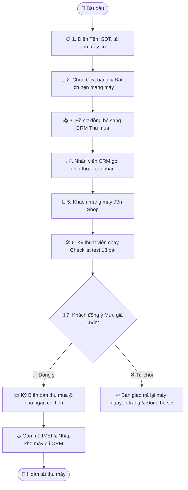

# Quy trình Nghiệp vụ: Bán Máy cũ Lấy Tiền mặt & Đặt Lịch hẹn

> **Mã quy trình:** Flow 06  
> **Mức độ phức tạp:** 3/5 (Khá phức tạp)  
> **Trọng tâm:** Khách hàng đăng ký bán chiếc máy đã định giá online để nhận tiền mặt hoặc chuyển khoản tại cửa hàng.  

---

## 1. Mục tiêu Quy trình
Chuyển đổi yêu cầu bán máy online thành lịch hẹn tại cửa hàng thực tế, chuẩn bị trước hồ sơ thu mua trên CRM.

## Sơ đồ Quy trình Trực quan (Flowchart)

## 2. Các Bên Tham gia (Actors)
- **Khách hàng**
- **Website PhoneX**
- **Nhân viên Thu mua CRM**
- **Kỹ thuật viên Chi nhánh**

## 3. Điều kiện Tiên quyết (Pre-conditions)
Khách đã có kết quả định giá máy cũ từ Flow 05.

---

## 4. Các Bước Thực hiện Chi tiết

### Bước 01: Điền Thông tin Đăng ký Bán máy
- **Chủ thể thực hiện:** `Khách hàng`
- **Hành động nghiệp vụ:** Khách nhập Họ tên, Số điện thoại liên hệ, số IMEI/Serial của máy (nếu biết) và tải lên 2-3 ảnh chụp thực tế thân máy.
- **Phản hồi hệ thống:** Khởi tạo hồ sơ thu mua mới với trạng thái 'Đã tiếp nhận' kèm toàn bộ thông tin tình trạng máy.

### Bước 02: Chọn Chi nhánh & Đặt Lịch hẹn
- **Chủ thể thực hiện:** `Khách hàng`
- **Hành động nghiệp vụ:** Khách chọn Cửa hàng thuận tiện nhất và chọn Ngày + Khung giờ mang máy tới (ví dụ: 10:00 Sáng thứ Bảy).
- **Phản hồi hệ thống:** Kiểm tra lịch làm việc của chi nhánh, tạo lịch hẹn trên CRM Calendar và phân bổ kỹ thuật viên trực.

### Bước 03: Tiếp nhận Hồ sơ & Gọi điện Xác nhận
- **Chủ thể thực hiện:** `Nhân viên CRM`
- **Hành động nghiệp vụ:** Nhân viên thu mua tại chi nhánh mở CRM, thấy hồ sơ mới, bấm gọi điện thoại cho khách để xác nhận nhu cầu và thời gian đến.
- **Phản hồi hệ thống:** Cập nhật trạng thái hồ sơ sang 'Đã xác nhận lịch hẹn'; gửi tin nhắn nhắc lịch cho khách.

### Bước 04: Khách mang máy đến Cửa hàng Thẩm định
- **Chủ thể thực hiện:** `Khách & Kỹ thuật viên`
- **Hành động nghiệp vụ:** Khách đọc số điện thoại đã đăng ký. Kỹ thuật viên mở đúng hồ sơ trên CRM và tiến hành quy trình kiểm tra 18 hạng mục phần cứng.
- **Phản hồi hệ thống:** Hồ sơ chuyển trạng thái sang 'Đang kiểm tra'.

### Bước 05: Báo Giá chốt & Khách Ký biên bản
- **Chủ thể thực hiện:** `Nhân viên & Khách hàng`
- **Hành động nghiệp vụ:** Nhân viên đưa ra mức giá chốt cuối cùng. Nếu khách đồng ý, in Biên bản thu mua máy cũ có chữ ký hai bên.
- **Phản hồi hệ thống:** Hệ thống ghi vết giá chốt vào hồ sơ thu mua; chuyển trạng thái sang 'Đã hoàn tất thu máy'.

### Bước 06: Chi tiền & Nhập kho Máy cũ
- **Chủ thể thực hiện:** `Kế toán / Thu ngân`
- **Hành động nghiệp vụ:** Thu ngân chuyển khoản tức thì hoặc chi tiền mặt cho khách. Máy cũ được gắn mã IMEI và nhập kho tiếp nhận.
- **Phản hồi hệ thống:** Kích hoạt tạo mã IMEI mới trên CRM Kho máy cũ với giá vốn bằng giá thu.

---

## 5. Dữ liệu Liên thông Website ↔ CRM
Hồ sơ thu mua từ Website lập tức đồng bộ vào CRM Thu mua. Lịch hẹn xuất hiện trên CRM Calendar của cửa hàng tương ứng.

## 6. Xử lý Tình huống Ngoại lệ (Edge Cases)
- **❓ Khách không đồng ý với mức giá thẩm định thực tế?**
  - 👉 *Giải pháp:* Kỹ thuật viên bàn giao lại máy nguyên trạng cho khách, đóng hồ sơ trên CRM với lý do 'Khách không đồng ý giá'.
- **❓ Máy bị khóa iCloud hoặc dính nợ cước nhà mạng?**
  - 👉 *Giải pháp:* Hệ thống từ chối thu mua theo chính sách pháp lý phòng chống máy không rõ nguồn gốc.
