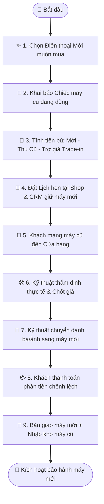

# Quy trình Nghiệp vụ: Thu cũ Đổi mới (Trade-in Flagship)

> **Mã quy trình:** Flow 07  
> **Mức độ phức tạp:** 3/5 (Khá phức tạp)  
> **Trọng tâm:** Khách hàng đổi máy cũ đang dùng lấy điện thoại đời mới, nhận thêm mức trợ giá Trade-in hấp dẫn và chỉ cần thanh toán phần chênh lệch.  

---

## 1. Mục tiêu Quy trình
Tạo ra luồng mua sắm kết hợp thông minh: vừa kích cầu bán máy mới, vừa thu mua được nguồn máy cũ chất lượng cao.

## Sơ đồ Quy trình Trực quan (Flowchart)

## 2. Các Bên Tham gia (Actors)
- **Khách hàng**
- **Website PhoneX**
- **Nhân viên Bán hàng CRM**
- **Kỹ thuật viên Thẩm định**

## 3. Điều kiện Tiên quyết (Pre-conditions)
Chiến dịch trợ giá Trade-in đang được kích hoạt cho dòng máy mới mà khách hàng lựa chọn.

---

## 4. Các Bước Thực hiện Chi tiết

### Bước 01: Chọn Máy Mới Muốn Mua
- **Chủ thể thực hiện:** `Khách hàng`
- **Hành động nghiệp vụ:** Khách chọn chiếc điện thoại mới (VD: iPhone 16 Pro Max 256GB - Giá 34.990.000đ) và bấm nút [Thu cũ đổi mới].
- **Phản hồi hệ thống:** Hệ thống lưu thông tin máy mới và kích hoạt bảng tính Trade-in.

### Bước 02: Khai báo Máy Cũ Đang Dùng
- **Chủ thể thực hiện:** `Khách hàng`
- **Hành động nghiệp vụ:** Khách khai báo máy cũ (VD: iPhone 13 Pro Max - Giá thu dự kiến 14.500.000đ).
- **Phản hồi hệ thống:** Tính toán mức trợ giá thu cũ của chiến dịch (VD: Tặng thêm 2.000.000đ khi lên đời iPhone 16 series).

### Bước 03: Xem Bảng Tính Tiền Bù Minh bạch
- **Chủ thể thực hiện:** `Khách hàng`
- **Hành động nghiệp vụ:** Hệ thống hiển thị rõ ràng công thức:
Giá máy mới (34.990.000đ) − Giá thu máy cũ (14.500.000đ) − Trợ giá Trade-in (2.000.000đ) = Tiền cần bù: 18.490.000đ.
- **Phản hồi hệ thống:** Cho phép chọn thêm phương án Trả góp 0% cho số tiền chênh lệch cần bù.

### Bước 04: Đăng ký Lịch hẹn Trade-in tại Cửa hàng
- **Chủ thể thực hiện:** `Khách hàng`
- **Hành động nghiệp vụ:** Khách chọn chi nhánh đến giao dịch, đặt lịch hẹn và để lại số điện thoại.
- **Phản hồi hệ thống:** Tạo giao dịch Trade-in trên CRM, đồng thời khóa tạm giữ 1 máy mới tại cửa hàng đó cho khách.

### Bước 05: Tiếp nhận & Thực hiện Giao dịch Kép tại Shop
- **Chủ thể thực hiện:** `Nhân viên Cửa hàng`
- **Hành động nghiệp vụ:** Tại cửa hàng, kỹ thuật viên thẩm định máy cũ và chốt giá. Nhân viên bán hàng lấy máy mới, trừ số tiền máy cũ và thu phần chênh lệch.
- **Phản hồi hệ thống:** CRM thực hiện song song 2 bút toán: Tạo hóa đơn Bán máy mới + Tạo phiếu Thu mua máy cũ.

### Bước 06: Hỗ trợ Chuyển dữ liệu & Trao máy mới
- **Chủ thể thực hiện:** `Nhân viên & Khách hàng`
- **Hành động nghiệp vụ:** Nhân viên kỹ thuật hỗ trợ backup chuyển toàn bộ danh bạ, ảnh từ máy cũ sang máy mới, reset sạch máy cũ và bàn giao máy mới cho khách.
- **Phản hồi hệ thống:** Kích hoạt thời hạn bảo hành cho máy mới; chuyển máy cũ vào kho chờ phân loại.

---

## 5. Dữ liệu Liên thông Website ↔ CRM
Phiếu Trade-in liên kết trực tiếp giữa Đơn hàng máy mới và Phiếu thu máy cũ trên CRM. Tồn kho máy mới giảm 1, tồn kho máy cũ tăng 1.

## 6. Xử lý Tình huống Ngoại lệ (Edge Cases)
- **❓ Tiền máy cũ cao hơn giá máy mới (ví dụ đổi máy phụ giá rẻ hơn)?**
  - 👉 *Giải pháp:* Hệ thống hỗ trợ Trade-in hoàn tiền: Cửa hàng chi trả lại phần tiền dư cho khách.
- **❓ Khách đổi ý không muốn bù tiền nữa?**
  - 👉 *Giải pháp:* Nhân viên có thể hủy hồ sơ Trade-in, nhả máy mới về kho, khách chỉ nhận tiền mặt bán máy cũ nếu vẫn muốn bán.
