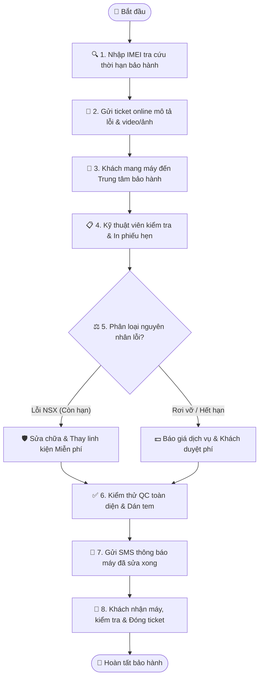

# Quy trình Nghiệp vụ: Tiếp nhận & Xử lý Bảo hành (RMA Support)

> **Mã quy trình:** Flow 08  
> **Mức độ phức tạp:** 3/5 (Khá phức tạp)  
> **Trọng tâm:** Khách hàng tra cứu bảo hành điện tử theo IMEI, gửi yêu cầu bảo hành online và theo dõi tiến độ sửa chữa từ kỹ thuật viên.  

---

## 1. Mục tiêu Quy trình
Chuẩn hóa quy trình hậu mãi, quản lý minh bạch lịch sử sửa chữa và cam kết thời gian bảo hành cho khách hàng.

## Sơ đồ Quy trình Trực quan (Flowchart)

## 2. Các Bên Tham gia (Actors)
- **Khách hàng**
- **Website PhoneX**
- **Nhân viên Tiếp nhận**
- **Kỹ thuật viên Sửa chữa CRM**

## 3. Điều kiện Tiên quyết (Pre-conditions)
Thiết bị có số IMEI đã được lưu trong cơ sở dữ liệu bán hàng của PhoneX.

---

## 4. Các Bước Thực hiện Chi tiết

### Bước 01: Tra cứu Thời hạn Bảo hành theo IMEI
- **Chủ thể thực hiện:** `Khách hàng`
- **Hành động nghiệp vụ:** Khách truy cập cổng bảo hành, nhập số IMEI hoặc Số điện thoại. Xác minh mã OTP gửi về máy.
- **Phản hồi hệ thống:** Hiển thị thông tin máy, ngày kích hoạt, ngày hết hạn bảo hành phần cứng và các gói bảo hành mở rộng (nếu có).

### Bước 02: Gửi Yêu cầu Bảo hành Trực tuyến
- **Chủ thể thực hiện:** `Khách hàng`
- **Hành động nghiệp vụ:** Khách mô tả hiện tượng lỗi (loa rè, sạc không vào, màn hình chớp tắt...), đính kèm video/ảnh lỗi và chọn chi nhánh mang máy tới.
- **Phản hồi hệ thống:** Tạo mã Phiếu bảo hành (VD: RMA-1029) trên CRM với trạng thái 'Đã tiếp nhận yêu cầu'.

### Bước 03: Tiếp nhận Máy thực tế tại Cửa hàng
- **Chủ thể thực hiện:** `Nhân viên Cửa hàng`
- **Hành động nghiệp vụ:** Khách mang máy đến chi nhánh. Nhân viên kiểm tra ngoại quan máy khi tiếp nhận (ghi rõ trầy xước cũ để tránh khiếu nại), in Biên nhận tiếp nhận máy gửi khách.
- **Phản hồi hệ thống:** Cập nhật trạng thái phiếu bảo hành sang 'Đã nhận máy tại shop - Chờ kiểm tra kỹ thuật'.

### Bước 04: Kỹ thuật viên Thẩm định Lỗi & Sửa chữa
- **Chủ thể thực hiện:** `Kỹ thuật viên CRM`
- **Hành động nghiệp vụ:** Kỹ thuật viên kiểm tra: Nếu lỗi do nhà sản xuất trong hạn bảo hành ➔ Thay linh kiện miễn phí. Nếu lỗi do người dùng (rơi vỡ, vào nước) ➔ Báo chi phí sửa dịch vụ.
- **Phản hồi hệ thống:** Cập nhật trạng thái sang 'Đang xử lý' hoặc 'Chờ linh kiện thay thế'.

### Bước 05: Kiểm thử Chất lượng (QC) & Hoàn tất
- **Chủ thể thực hiện:** `Kỹ thuật viên`
- **Hành động nghiệp vụ:** Sau khi thay thế linh kiện, kỹ thuật viên chạy bài test toàn diện (nghe gọi, cảm ứng, pin, camera), dán tem bảo hành linh kiện.
- **Phản hồi hệ thống:** Chuyển trạng thái phiếu sang 'Đã sửa xong - Chờ khách nhận máy'. Tự động gửi SMS thông báo cho khách.

### Bước 06: Trả máy cho Khách hàng
- **Chủ thể thực hiện:** `Khách & Nhân viên`
- **Hành động nghiệp vụ:** Khách mang phiếu hẹn đến nhận máy, kiểm tra lại toàn bộ chức năng, ký xác nhận hoàn tất dịch vụ.
- **Phản hồi hệ thống:** Đóng phiếu bảo hành; lưu toàn bộ lịch sử thay thế linh kiện vào hồ sơ IMEI của chiếc máy đó.

---

## 5. Dữ liệu Liên thông Website ↔ CRM
Tiến độ xử lý của kỹ thuật viên trên CRM cập nhật tức thì lên trang tra cứu bảo hành của Website để khách hàng tự theo dõi bất cứ lúc nào.

## 6. Xử lý Tình huống Ngoại lệ (Edge Cases)
- **❓ Máy bị lỗi nhưng đã hết hạn bảo hành?**
  - 👉 *Giải pháp:* CRM tự động chuyển sang luồng 'Sửa chữa tính phí', gửi bảng báo giá linh kiện cho khách duyệt trước khi làm.
- **❓ Linh kiện đặc thù chưa có sẵn trong kho?**
  - 👉 *Giải pháp:* Kỹ thuật viên cập nhật trạng thái 'Chờ điều chuyển linh kiện' kèm ngày dự kiến xong để khách yên tâm.
