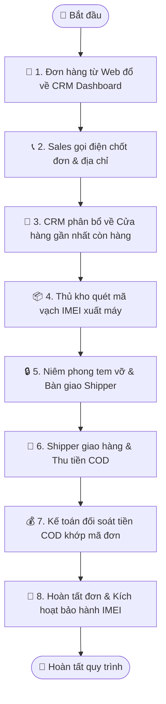

# Quy trình Nghiệp vụ: Điều phối & Xử lý Đơn hàng trên CRM (Fulfillment)

> **Mã quy trình:** Flow 09  
> **Mức độ phức tạp:** 4/5 (Phức tạp)  
> **Trọng tâm:** Quy trình vận hành nội bộ từ khi nhận đơn hàng mới trên web, phân bổ kho, đóng gói, xuất kho cho đến giao hàng thành công.  

---

## 1. Mục tiêu Quy trình
Đảm bảo đơn hàng được xử lý chính xác, nhanh chóng, đúng model/màu sắc/IMEI và không bao giờ xảy ra tình trạng thất thoát hàng hóa.

## Sơ đồ Quy trình Trực quan (Flowchart)

## 2. Các Bên Tham gia (Actors)
- **Nhân viên Sales CRM**
- **Thủ kho**
- **Đơn vị Vận chuyển / Shipper**
- **Kế toán**

## 3. Điều kiện Tiên quyết (Pre-conditions)
Đơn hàng mới được khách hàng gửi thành công từ Website hoặc tạo trực tiếp tại quầy.

---

## 4. Các Bước Thực hiện Chi tiết

### Bước 01: Tiếp nhận Đơn trên CRM Dashboard
- **Chủ thể thực hiện:** `Nhân viên Bán hàng`
- **Hành động nghiệp vụ:** Đơn hàng mới đổ về mục 'Đơn chờ xác nhận'. Nhân viên gọi điện thoại cho khách để chốt địa chỉ, thời gian nhận và xuất hóa đơn VAT (nếu cần).
- **Phản hồi hệ thống:** Chuyển trạng thái đơn sang 'Đã xác nhận'. Nếu không liên lạc được sau 3 cuộc gọi, đánh dấu 'Chờ liên hệ lại'.

### Bước 02: Phân bổ Chi nhánh & Xuất lệnh Soạn hàng
- **Chủ thể thực hiện:** `Hệ thống & Quản lý`
- **Hành động nghiệp vụ:** Dựa trên địa chỉ nhận hàng, hệ thống tự động gán đơn về cửa hàng gần khách nhất có sẵn hàng trong kho.
- **Phản hồi hệ thống:** Tạo lệnh xuất kho (Pick list) gửi đến máy tính hoặc điện thoại của thủ kho chi nhánh đó.

### Bước 03: Thủ kho Quét mã IMEI & Đóng gói
- **Chủ thể thực hiện:** `Thủ kho`
- **Hành động nghiệp vụ:** Thủ kho lấy máy từ tủ an toàn, dùng máy quét barcode quét đúng mã IMEI của chiếc máy. Hệ thống tự động gán IMEI này vào chi tiết đơn hàng.
- **Phản hồi hệ thống:** Khóa IMEI này vào đơn, không cho phép bán cho đơn khác. In phiếu đóng gói và phiếu bảo hành kèm theo.

### Bước 04: Bàn giao Đơn vị Vận chuyển (Shipper)
- **Chủ thể thực hiện:** `Thủ kho & Shipper`
- **Hành động nghiệp vụ:** Giao kiện hàng đã niêm phong tem vỡ cho shipper. Shipper ký nhận trên biên bản bàn giao ca hàng.
- **Phản hồi hệ thống:** Cập nhật trạng thái đơn thành 'Đang giao hàng', đồng bộ mã vận đơn để khách theo dõi trên Website.

### Bước 05: Khách Nhận hàng & Thu tiền (COD)
- **Chủ thể thực hiện:** `Shipper & Khách hàng`
- **Hành động nghiệp vụ:** Khách kiểm tra tem niêm phong, thanh toán tiền cho shipper (nếu chọn COD) và ký nhận.
- **Phản hồi hệ thống:** Shipper cập nhật trạng thái 'Giao hàng thành công' qua app kết nối hệ thống; CRM chuyển sang 'Đã giao'.

### Bước 06: Đối soát Tiền & Hoàn tất Đơn hàng
- **Chủ thể thực hiện:** `Kế toán`
- **Hành động nghiệp vụ:** Kế toán nhận tiền đối soát từ đối tác giao vận hoặc tài khoản ngân hàng, khớp mã đơn và bấm [Hoàn tất đơn].
- **Phản hồi hệ thống:** Ghi nhận doanh thu, trừ tồn kho vĩnh viễn, kích hoạt thời hạn bảo hành điện tử chính thức cho mã IMEI vừa bán.

---

## 5. Dữ liệu Liên thông Website ↔ CRM
Mỗi bước đổi trạng thái trên CRM sẽ kích hoạt thông báo cập nhật ngay lập tức trên trang Tra cứu đơn hàng của khách hàng.

## 6. Xử lý Tình huống Ngoại lệ (Edge Cases)
- **❓ Khách từ chối nhận hàng (Bom hàng)?**
  - 👉 *Giải pháp:* Shipper hoàn hàng về shop, nhân viên chọn 'Giao thất bại' ➔ Nhập lại IMEI về kho ➔ Chuyển đơn sang 'Đã hủy'.
- **❓ Khách muốn đổi sang màu khác khi shipper đang giao?**
  - 👉 *Giải pháp:* Nhân viên CSKH tạo yêu cầu điều phối đổi mã máy, thu hồi kiện cũ và tạo lệnh giao mã mới.
