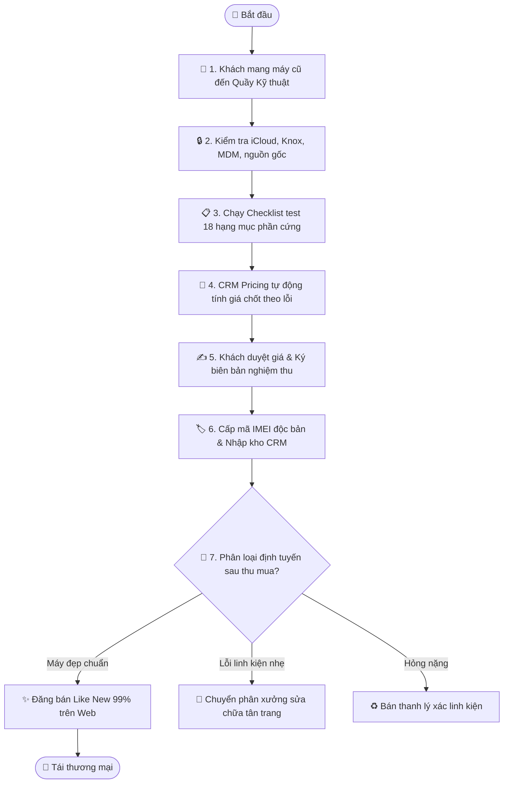

# Quy trình Nghiệp vụ: Kiểm định Kỹ thuật & Nhập kho Máy cũ

> **Mã quy trình:** Flow 10  
> **Mức độ phức tạp:** 4/5 (Phức tạp)  
> **Trọng tâm:** Quy trình kiểm tra 18 bước phần cứng của kỹ thuật viên để định giá chính xác, gắn mã IMEI và nhập kho tái thương mại.  

---

## 1. Mục tiêu Quy trình
Chuẩn hóa chất lượng máy thu mua đầu vào, ngăn ngừa rủi ro mua phải máy dựng, máy lỗi ẩn hoặc máy nguồn gốc bất hợp pháp.

## Sơ đồ Quy trình Trực quan (Flowchart)

## 2. Các Bên Tham gia (Actors)
- **Kỹ thuật viên Thẩm định**
- **Thủ kho**
- **Phần mềm CRM Kiểm định**

## 3. Điều kiện Tiên quyết (Pre-conditions)
Máy cũ được khách hàng mang đến từ Flow 06 (Bán máy) hoặc Flow 07 (Trade-in).

---

## 4. Các Bước Thực hiện Chi tiết

### Bước 01: Kiểm tra Pháp lý & Nguồn gốc Máy
- **Chủ thể thực hiện:** `Kỹ thuật viên`
- **Hành động nghiệp vụ:** Kiểm tra số IMEI/Serial trên hệ thống nhà sản xuất; kiểm tra tình trạng khóa tài khoản (iCloud ẩn, Knox, MDM công ty, blacklist mất cắp).
- **Phản hồi hệ thống:** Yêu cầu khách đăng xuất hoàn toàn tài khoản cá nhân và khôi phục cài đặt gốc (Reset Factory).

### Bước 02: Thực hiện Bài Test 18 Hạng mục Phần cứng
- **Chủ thể thực hiện:** `Kỹ thuật viên`
- **Hành động nghiệp vụ:** Kiểm tra chi tiết theo checklist điện tử trên CRM: Ngoại quan thân vỏ, Màn hình & Cảm ứng, Face ID/Touch ID, Cụm camera trước/sau, Micro & Loa trong/ngoài, Cổng sạc & Kết nối sóng Wifi/Bluetooth/5G, Dung lượng pin thực tế, Cảm biến tiệm cận & con quay hồi chuyển.
- **Phản hồi hệ thống:** Kỹ thuật viên tích chọn từng hạng mục Đạt / Lỗi trên màn hình CRM Kiểm định.

### Bước 03: CRM Tự động Tính toán Mức giá Chốt
- **Chủ thể thực hiện:** `Hệ thống CRM`
- **Hành động nghiệp vụ:** Dựa trên các lỗi được kỹ thuật viên đánh dấu, động cơ Pricing Engine tự động trừ tiền theo bảng quy tắc.
- **Phản hồi hệ thống:** Hiển thị 'Mức giá thu mua đề xuất cuối cùng' kèm bảng liệt kê chi tiết các khoản khấu trừ để giải thích cho khách.

### Bước 04: Khách hàng Chốt giá & Ký biên bản
- **Chủ thể thực hiện:** `Khách & Nhân viên`
- **Hành động nghiệp vụ:** Nhân viên giải thích rõ các lỗi đã phát hiện. Khi khách đồng ý bán, hệ thống in Phiếu biên bản thẩm định có chữ ký xác nhận của cả hai bên.
- **Phản hồi hệ thống:** Ghi nhận hồ sơ thu mua hoàn tất; tự động xuất phiếu chi tài chính.

### Bước 05: Gán mã IMEI & Khởi tạo Hồ sơ Thiết bị
- **Chủ thể thực hiện:** `Kỹ thuật viên`
- **Hành động nghiệp vụ:** Chiếc máy chính thức được cấp 1 hồ sơ thiết bị độc bản trên CRM theo số IMEI, lưu trữ toàn bộ lịch sử: Nguồn gốc thu từ ai, ngày giờ thu, kết quả test và giá nhập.
- **Phản hồi hệ thống:** Ghi nhận trạng thái IMEI: 'Mới nhập kho - Chờ phân loại'.

### Bước 06: Phân loại & Định tuyến Sau thu mua
- **Chủ thể thực hiện:** `Kỹ thuật viên & Thủ kho`
- **Hành động nghiệp vụ:** Máy được phân luồng:
- Nhánh 1: Máy đẹp chuẩn ➔ Vệ sinh, dán nhãn, chuyển sang trạng thái 'Sẵn sàng bán' (Like New 99%).
- Nhánh 2: Máy có lỗi linh kiện nhỏ ➔ Chuyển sang trạng thái 'Chờ sửa chữa tân trang' (thay pin/thay màn).
- Nhánh 3: Máy hỏng nặng ➔ Bán thanh lý xác linh kiện.
- **Phản hồi hệ thống:** Cập nhật trạng thái máy trên CRM và hiển thị lên danh mục máy cũ của Website (nếu là Nhánh 1).

---

## 5. Dữ liệu Liên thông Website ↔ CRM
Biên bản kiểm định lưu vết vĩnh viễn trên CRM. Máy ở trạng thái 'Sẵn sàng bán' sẽ lập tức xuất hiện trên Website mục 'Điện thoại cũ' của chi nhánh đó.

## 6. Xử lý Tình huống Ngoại lệ (Edge Cases)
- **❓ Kỹ thuật viên kiểm tra sơ sài bỏ sót lỗi?**
  - 👉 *Giải pháp:* CRM lưu định danh nhân viên thực hiện kiểm định. Nếu máy bán ra bị khách bảo hành lỗi cũ, hệ thống truy vết trách nhiệm người duyệt.
- **❓ Máy bị trùng IMEI đã có trong cơ sở dữ liệu?**
  - 👉 *Giải pháp:* Hệ thống chặn tạo mới và cảnh báo đỏ: 'Cảnh báo: IMEI này đã từng được thu mua hoặc tồn tại trong kho'.
