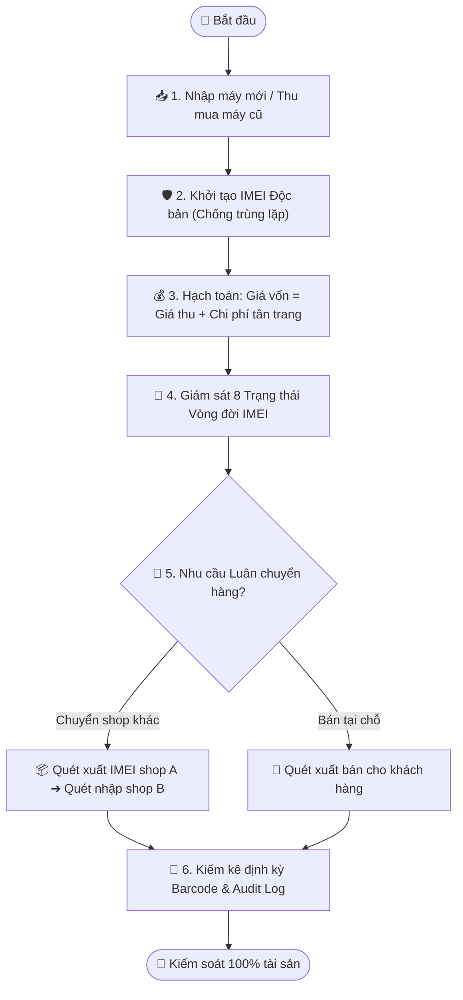

# Quy trình Nghiệp vụ: Quản trị Vòng đời IMEI & Tồn kho Đa điểm

> **Mã quy trình:** Flow 11  
> **Mức độ phức tạp:** 5/5 (Rất phức tạp)  
> **Trọng tâm:** Kiểm soát chi tiết từng chiếc điện thoại cũ và mới theo số IMEI độc nhất qua 8 trạng thái, hạch toán giá vốn và điều chuyển kho nội bộ.  

---

## 1. Mục tiêu Quy trình
Quản trị chính xác 100% tồn kho đến từng cá thể máy (Serial/IMEI), ngăn ngừa hoàn toàn thất thoát và minh bạch tỷ suất lợi nhuận gộp.

## Sơ đồ Quy trình Trực quan (Flowchart)

## 2. Các Bên Tham gia (Actors)
- **Quản lý Kho tổng**
- **Thủ kho Chi nhánh**
- **Ban Giám đốc**
- **Hệ thống CRM**

## 3. Điều kiện Tiên quyết (Pre-conditions)
Máy mới nhập từ nhà phân phối hoặc máy cũ thu mua từ khách hàng đã được nạp mã IMEI.

---

## 4. Các Bước Thực hiện Chi tiết

### Bước 01: Khởi tạo Thực thể IMEI Độc bản
- **Chủ thể thực hiện:** `Hệ thống CRM`
- **Hành động nghiệp vụ:** Mỗi chiếc điện thoại có 1 số IMEI/Serial duy nhất được kiểm soát tính toàn vẹn (Không bao giờ có 2 máy trùng IMEI).
- **Phản hồi hệ thống:** Khởi tạo bản ghi IMEI với thuộc tính: Hãng, Model, Màu, Dung lượng, Loại máy (Mới/Cũ), Vị trí kho chi nhánh.

### Bước 02: Theo dõi 8 Trạng thái Vòng đời IMEI
- **Chủ thể thực hiện:** `Thủ kho & Kỹ thuật`
- **Hành động nghiệp vụ:** Máy cũ di chuyển tuần tự qua các trạng thái:
1. Chờ kiểm tra ➔ 2. Đang kiểm tra ➔ 3. Chờ sửa chữa ➔ 4. Đang sửa chữa ➔ 5. Sẵn sàng bán ➔ 6. Đang giữ chỗ (khách đặt) ➔ 7. Đã bán ➔ 8. Đang bảo hành.
- **Phản hồi hệ thống:** Cập nhật realtime lên bảng tổng hợp tồn kho và giao diện Website.

### Bước 03: Hạch toán Giá vốn Máy cũ Chặt chẽ
- **Chủ thể thực hiện:** `Kế toán Kho`
- **Hành động nghiệp vụ:** Giá vốn chiếc máy cũ = Giá thu mua ban đầu + Chi phí linh kiện thay thế + Chi phí công thợ tân trang. Từ đó xác định Giá niêm yết bán ra đảm bảo biên lợi nhuận mục tiêu.
- **Phản hồi hệ thống:** Tự động tính lãi gộp dự kiến (Expected Gross Profit) cho từng IMEI khi đăng bán.

### Bước 04: Quy trình Điều chuyển Kho Liên chi nhánh
- **Chủ thể thực hiện:** `Thủ kho Xuất & Nhập`
- **Hành động nghiệp vụ:** Khi Cửa hàng A thiếu hàng nhưng Cửa hàng B còn hàng: Tạo Phiếu điều chuyển ➔ Cửa hàng B xuất kho quét IMEI (Trạng thái: Đang vận chuyển) ➔ Cửa hàng A nhận máy quét IMEI xác nhận nhập kho.
- **Phản hồi hệ thống:** Tồn kho chi nhánh B giảm 1, chi nhánh A tăng 1, không làm mất cân đối tổng kho toàn chuỗi.

### Bước 05: Kiểm kê Định kỳ Bằng Quét Mã Vạch Barcode
- **Chủ thể thực hiện:** `Thủ kho`
- **Hành động nghiệp vụ:** Cuối mỗi tuần/tháng, thủ kho dùng máy quét không dây quét lần lượt tất cả các máy trong tủ. CRM so sánh số quét được với số tồn trên phần mềm.
- **Phản hồi hệ thống:** Phát hiện ngay lập tức máy bị lệch vị trí hoặc máy bị thất thoát để lập biên bản xử lý.

### Bước 06: Nhật ký Lịch sử Toàn diện (Audit Trail)
- **Chủ thể thực hiện:** `Quản trị viên & Kiểm toán`
- **Hành động nghiệp vụ:** Mở chi tiết bất kỳ mã IMEI nào đều xem được toàn bộ dòng thời gian: Ai là người thu, ai đã sửa, ai đã chuyển kho, ai đã bán và ai đã duyệt giá.
- **Phản hồi hệ thống:** Bản ghi nhật ký được mã hóa và không cho phép bất kỳ ai sửa hoặc xóa.

---

## 5. Dữ liệu Liên thông Website ↔ CRM
Website chỉ hiển thị bán những máy có trạng thái 'Sẵn sàng bán' tại đúng chi nhánh mà khách hàng đang xem tồn kho.

## 6. Xử lý Tình huống Ngoại lệ (Edge Cases)
- **❓ Nhân viên vô tình quét sai mã IMEI của máy khác khi giao cho khách?**
  - 👉 *Giải pháp:* CRM kiểm tra đối chiếu mã sản phẩm và cảnh báo âm thanh lỗi: 'Sai model/màu sắc so với đơn hàng'.
- **❓ Máy bị hỏng hoàn toàn trong quá trình lưu kho?**
  - 👉 *Giải pháp:* Yêu cầu cấp Quản lý trở lên phê duyệt biên bản xuất hủy hư hỏng (Scrap) kèm lý do xác thực.
