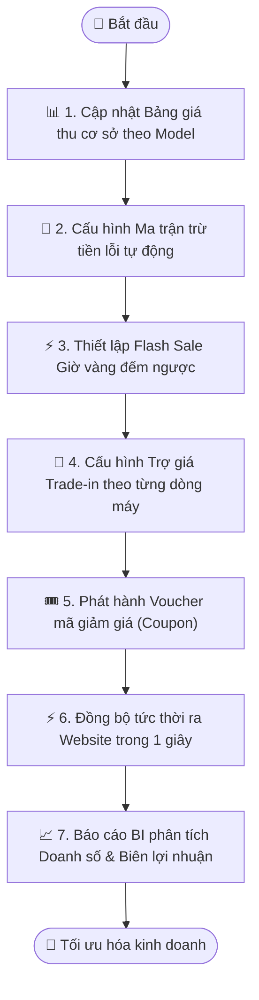

# Quy trình Nghiệp vụ: Động cơ Định giá Thu mua & Quản trị Khuyến mãi

> **Mã quy trình:** Flow 12  
> **Mức độ phức tạp:** 5/5 (Rất phức tạp)  
> **Trọng tâm:** Hệ thống trung tâm thiết lập bảng giá thu mua máy cũ, cấu hình ma trận khấu trừ lỗi tự động và điều hành các chiến dịch khuyến mãi, Flash Sale, voucher.  

---

## 1. Mục tiêu Quy trình
Tự động hóa hoàn toàn bài toán tính giá phức tạp, giúp nhân viên tại quầy và khách hàng trên web luôn nhận được mức giá đồng nhất, tối ưu lợi nhuận.

## Sơ đồ Quy trình Trực quan (Flowchart)

## 2. Các Bên Tham gia (Actors)
- **Ban Giám đốc**
- **Trưởng phòng Kinh doanh**
- **Marketing CRM**
- **Website PhoneX**

## 3. Điều kiện Tiên quyết (Pre-conditions)
Tài khoản người dùng có quyền Quản trị cấp cao (Admin / Manager) trên hệ thống CRM.

---

## 4. Các Bước Thực hiện Chi tiết

### Bước 01: Cấu hình Bảng giá Thu mua Cơ sở (Base Price)
- **Chủ thể thực hiện:** `Trưởng phòng Kinh doanh`
- **Hành động nghiệp vụ:** Cập nhật giá thu máy cũ chuẩn (loại máy đẹp nguyên bản) theo từng dòng máy và dung lượng định kỳ hàng tuần theo biến động thị trường.
- **Phản hồi hệ thống:** Lưu phiên bản bảng giá mới kèm ngày giờ áp dụng; lưu trữ toàn bộ lịch sử bảng giá cũ.

### Bước 02: Thiết lập Ma trận Quy tắc Khấu trừ (Deduction Rules)
- **Chủ thể thực hiện:** `Trưởng phòng Kinh doanh`
- **Hành động nghiệp vụ:** Cấu hình số tiền hoặc % khấu trừ cho từng lỗi cụ thể:
- Vỏ trầy xước nhẹ: −300.000đ | Cấn móp góc: −800.000đ
- Màn hình trầy: −500.000đ | Màn hình sọc: −2.500.000đ
- Pin dưới 80%: −600.000đ | Hỏng Face ID: −1.500.000đ
- Không phụ kiện sạc: −200.000đ.
- **Phản hồi hệ thống:** Tạo thành bộ công thức logic động (Pricing Rules Engine) áp dụng tức thời cho cả Website và CRM.

### Bước 03: Tạo Chiến dịch Khuyến mãi & Flash Sale
- **Chủ thể thực hiện:** `Phòng Marketing`
- **Hành động nghiệp vụ:** Thiết lập chương trình Flash Sale: Tên chương trình, Khung giờ vàng (VD: 20h - 22h tối nay), Danh sách sản phẩm giảm giá, Số lượng giới hạn.
- **Phản hồi hệ thống:** Website tự động hiển thị đồng hồ đếm ngược và nhãn Flash Sale khi đến đúng khung giờ hẹn.

### Bước 04: Cấu hình Trợ giá Trade-in theo Dòng máy
- **Chủ thể thực hiện:** `Marketing & Kinh doanh`
- **Hành động nghiệp vụ:** Tạo chính sách 'Trợ giá lên đời': Khách đổi máy bất kỳ lên dòng Flagship mới sẽ được tặng thêm từ 1.000.000đ đến 3.000.000đ vào giá thu máy cũ.
- **Phản hồi hệ thống:** Website tự động cộng thêm số tiền trợ giá này vào bảng tính bù tiền của khách ở Flow 07.

### Bước 05: Quản lý Mã Giảm giá (Voucher & Coupon)
- **Chủ thể thực hiện:** `Marketing`
- **Hành động nghiệp vụ:** Phát hành voucher: Giảm theo số tiền cố định hoặc theo %, giới hạn giá trị đơn hàng tối thiểu, giới hạn số lượt dùng của mỗi khách.
- **Phản hồi hệ thống:** Kiểm tra tính hợp lệ và chặn gian lận tự động khi khách áp dụng mã tại màn hình Checkout.

### Bước 06: Báo cáo Hiệu quả Chiến dịch & Tỷ suất Lợi nhuận
- **Chủ thể thực hiện:** `Ban Giám đốc`
- **Hành động nghiệp vụ:** Xem biểu đồ trực quan: Số lượng voucher đã sử dụng, Doanh thu từ Flash Sale, Số lượng hồ sơ Trade-in được trợ giá, Biên lợi nhuận ròng của các máy cũ thu vào.
- **Phản hồi hệ thống:** Tổng hợp số liệu từ toàn bộ đơn hàng thực tế phát sinh trên toàn chuỗi cửa hàng.

---

## 5. Dữ liệu Liên thông Website ↔ CRM
Bảng giá thu mua và chương trình khuyến mãi được điều khiển từ CRM và đồng bộ tức thời ra Website trong vòng 1 giây.

## 6. Xử lý Tình huống Ngoại lệ (Edge Cases)
- **❓ Thị trường biến động mạnh, giá máy cũ giảm đột ngột?**
  - 👉 *Giải pháp:* Quản lý chỉ cần cập nhật Giá cơ sở trên CRM, toàn bộ các luồng Định giá online trên Web sẽ tự động đổi theo ngay lập tức.
- **❓ Hai chương trình khuyến mãi bị trùng lặp ưu đãi?**
  - 👉 *Giải pháp:* Hệ thống có cơ chế kiểm tra chống cộng dồn (Non-stackable) hoặc áp dụng mức ưu đãi cao nhất cho khách hàng.
