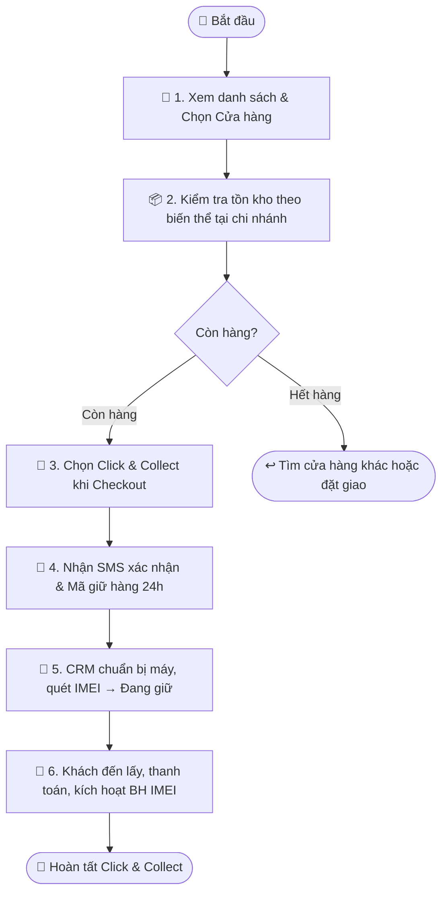

# Quy trình Nghiệp vụ: Click & Collect — Đặt Giữ Máy Tại Cửa Hàng

> **Mã quy trình:** Flow 13  
> **Mức độ phức tạp:** 2/5 (Trung bình thấp)  
> **Trọng tâm:** Khách hàng kiểm tra tồn kho thực tế theo cửa hàng, chọn đặt giữ máy online, nhân viên xác nhận và khách đến lấy tại quầy.  

---

## 1. Mục tiêu Quy trình
Giảm thiểu tình trạng khách đến cửa hàng mà không có hàng, đồng thời chuyển đổi lượt truy cập online thành doanh thu offline chắc chắn.

## Sơ đồ Quy trình Trực quan (Flowchart)

## 2. Các Bên Tham gia (Actors)
- **Khách hàng**
- **Nhân viên Sales CRM**
- **Thủ kho**
- **Website PhoneX**

## 3. Các Bước Chi tiết

### Bước 1: 🏪 Xem danh sách Cửa hàng
**Người thực hiện:** Khách hàng  
**Hành động:** Vào trang Cửa hàng trên website, lọc theo Tỉnh/Thành phố và Quận/Huyện, chọn cửa hàng phù hợp.  
**Kết quả:** Trang chi tiết cửa hàng (địa chỉ, hotline, giờ hoạt động, bản đồ, dịch vụ).

### Bước 2: 📦 Kiểm tra Tồn kho theo Cửa hàng
**Người thực hiện:** Khách hàng  
**Hành động:** Trên trang sản phẩm hoặc trang cửa hàng, xem tồn kho theo biến thể màu sắc/dung lượng tại từng chi nhánh.  
**Kết quả:** Badge trạng thái: Còn hàng / Ít hàng / Hết hàng theo từng cửa hàng.

### Bước 3: 🛒 Chọn Click & Collect khi Checkout
**Người thực hiện:** Khách hàng  
**Hành động:** Trong luồng checkout, thay vì chọn 'Giao tận nơi', khách chọn 'Nhận tại cửa hàng', chọn chi nhánh muốn lấy hàng.  
**Kết quả:** Hệ thống xác nhận tồn kho tức thời và giữ máy trong 24 giờ.

### Bước 4: 📲 Nhận xác nhận Đặt giữ
**Người thực hiện:** Khách hàng  
**Hành động:** Nhận SMS/thông báo xác nhận đặt giữ máy, thông tin cửa hàng, giờ đến lấy và thời hạn giữ hàng.  
**Kết quả:** Mã đặt giữ (reservation code) + thời hạn giữ 24h.

### Bước 5: 🔔 CRM nhận yêu cầu & Chuẩn bị hàng
**Người thực hiện:** Nhân viên Sales CRM / Thủ kho  
**Hành động:** CRM hiển thị đơn Click & Collect trong dashboard, thủ kho quét IMEI và tách hàng ra khu vực 'Đang giữ cho khách'.  
**Kết quả:** IMEI được cập nhật trạng thái 'Đang giữ', in phiếu giữ hàng kèm tên khách.

### Bước 6: 🤝 Khách đến lấy hàng & Thanh toán tại quầy
**Người thực hiện:** Nhân viên Sales CRM / Khách hàng  
**Hành động:** Nhân viên tra mã đặt giữ, kiểm tra CMND/CCCD, xuất hàng và thanh toán tiền mặt hoặc chuyển khoản.  
**Kết quả:** Hóa đơn bán hàng, kích hoạt bảo hành IMEI, đóng đơn Click & Collect.

## 4. Đồng bộ Website ↔ CRM
Khi IMEI được giữ (bước 5), tồn kho hiển thị trên website giảm ngay lập tức. Nếu khách không đến lấy sau 24h, hệ thống tự giải phóng IMEI trở lại 'Sẵn sàng bán'.

## 5. Trường hợp Ngoại lệ

| Tình huống | Xử lý |
|-----------|-------|
| ⚠️ Khách không đến đúng hẹn | Hệ thống tự hủy giữ sau 24h, gửi SMS nhắc trước 2h. |
| ⚠️ Tồn kho thay đổi sau khi giữ | IMEI đã lock — không thể bán cho người khác khi đang giữ. |
| ⚠️ Khách muốn đổi cửa hàng nhận | Cần hủy đặt giữ cũ, kiểm tra tồn kho chi nhánh mới và tạo lại. |

---
*Nguồn: Mục 14 — Tài liệu Yêu cầu Dự án PhoneX*
