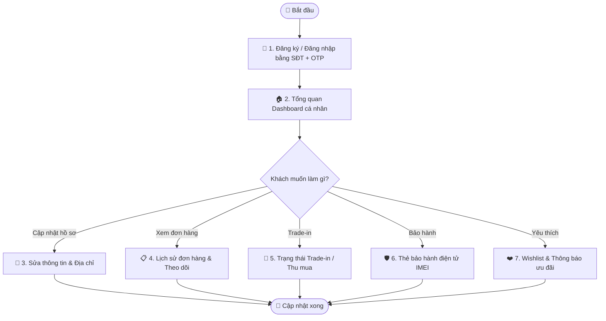

# Quy trình Nghiệp vụ: Tài khoản Khách hàng & Member Portal

> **Mã quy trình:** Flow 14  
> **Mức độ phức tạp:** 2/5 (Trung bình thấp)  
> **Trọng tâm:** Khách hàng đăng ký tài khoản, đăng nhập và quản lý hồ sơ cá nhân, lịch sử mua hàng, Trade-in, bảo hành và thiết bị yêu thích.  

---

## 1. Mục tiêu Quy trình
Tạo ra điểm chạm kỹ thuật số trung tâm để khách hàng tự phục vụ, theo dõi mọi tương tác với PhoneX mà không cần gọi hotline.

## Sơ đồ Quy trình Trực quan (Flowchart)

## 2. Các Bên Tham gia (Actors)
- **Khách hàng (Member)**
- **Hệ thống Website**
- **CRM PhoneX**

## 3. Các Bước Chi tiết

### Bước 1: 📝 Đăng ký Tài khoản
**Người thực hiện:** Khách hàng  
**Hành động:** Điền số điện thoại, họ tên, mật khẩu; xác minh OTP qua SMS. Tài khoản là tùy chọn — khách có thể mua hàng không cần đăng ký.  
**Kết quả:** Tài khoản Member được tạo và liên kết với profile trong CRM.

### Bước 2: 🏠 Tổng quan Dashboard cá nhân
**Người thực hiện:** Khách hàng  
**Hành động:** Sau đăng nhập, xem tổng quan: số đơn hàng đang xử lý, Trade-in đang chờ, thiết bị đang bảo hành và thông báo chưa đọc.  
**Kết quả:** Màn hình hub cá nhân — one-stop overview.

### Bước 3: 👤 Cập nhật Thông tin cá nhân & Địa chỉ
**Người thực hiện:** Khách hàng  
**Hành động:** Sửa họ tên, SĐT, email, ngày sinh; thêm/xóa địa chỉ giao hàng (tối đa 5 địa chỉ), đặt địa chỉ mặc định.  
**Kết quả:** Thông tin được đồng bộ vào profile khách hàng trong CRM.

### Bước 4: 📋 Xem lịch sử Đơn hàng
**Người thực hiện:** Khách hàng  
**Hành động:** Danh sách tất cả đơn hàng kèm trạng thái, ngày đặt, sản phẩm, giá. Click vào từng đơn để xem chi tiết và theo dõi vận chuyển.  
**Kết quả:** Lịch sử mua hàng đầy đủ, minh bạch.

### Bước 5: 🔄 Theo dõi Trade-in & Thu mua
**Người thực hiện:** Khách hàng  
**Hành động:** Xem danh sách yêu cầu Trade-in/Thu mua đã gửi kèm trạng thái hiện tại (Đã tiếp nhận / Đã hẹn / Hoàn tất / Hủy).  
**Kết quả:** Thông tin tiến độ không cần gọi hotline.

### Bước 6: 🛡️ Quản lý Bảo hành thiết bị
**Người thực hiện:** Khách hàng  
**Hành động:** Xem danh sách thiết bị đang trong hạn bảo hành, lịch sử sửa chữa và ticket bảo hành đang xử lý.  
**Kết quả:** Thẻ bảo hành điện tử theo IMEI.

### Bước 7: ❤️ Danh sách Yêu thích & Thông báo
**Người thực hiện:** Khách hàng  
**Hành động:** Lưu sản phẩm yêu thích, bật thông báo giảm giá. Xem trung tâm thông báo (đơn hàng, khuyến mãi, bảo hành).  
**Kết quả:** Engagement liên tục giữa khách hàng và PhoneX.

## 4. Đồng bộ Website ↔ CRM
Mọi thay đổi thông tin cá nhân từ portal đồng bộ ngay lập tức vào profile khách hàng trong CRM. Khi CRM cập nhật trạng thái đơn hàng/Trade-in, khách thấy ngay trong portal và nhận thông báo.

## 5. Trường hợp Ngoại lệ

| Tình huống | Xử lý |
|-----------|-------|
| ⚠️ Quên mật khẩu | Gửi link đặt lại mật khẩu qua SMS OTP. |
| ⚠️ Khách mua không đăng ký, sau muốn tạo tài khoản | Hệ thống tự merge lịch sử mua hàng theo SĐT. |
| ⚠️ Cùng SĐT nhiều tài khoản | Hệ thống chặn — mỗi SĐT chỉ 1 tài khoản Member. |

---
*Nguồn: Mục 17 — Tài liệu Yêu cầu Dự án PhoneX*
