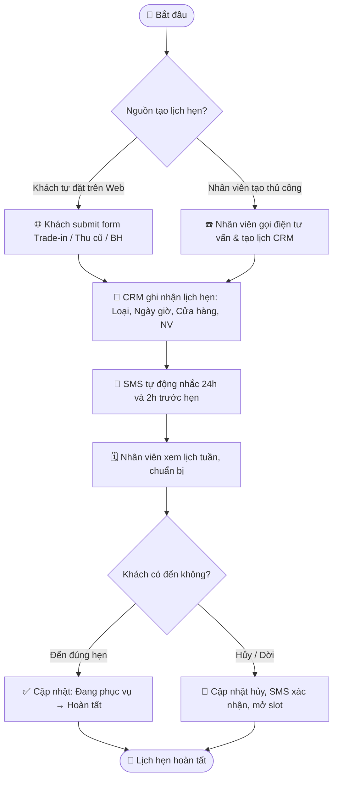

# Quy trình Nghiệp vụ: Lịch hẹn CRM — Quản lý Tập trung

> **Mã quy trình:** Flow 15  
> **Mức độ phức tạp:** 3/5 (Khá phức tạp)  
> **Trọng tâm:** Hệ thống quản lý tập trung tất cả lịch hẹn phát sinh từ 4 nghiệp vụ: Thu máy cũ, Trade-in, Bảo hành và Click & Collect; phân bổ nhân viên và gửi nhắc nhở tự động.  

---

## 1. Mục tiêu Quy trình
Loại bỏ tình trạng lịch hẹn bị bỏ lỡ, giảm thời gian chờ tại quầy và tối ưu hóa lịch làm việc của nhân viên theo từng cửa hàng.

## Sơ đồ Quy trình Trực quan (Flowchart)

## 2. Các Bên Tham gia (Actors)
- **Khách hàng**
- **Nhân viên Sales / Thu mua / Kỹ thuật**
- **Quản lý Cửa hàng**
- **CRM PhoneX**

## 3. Các Bước Chi tiết

### Bước 1: 📅 Khách đặt lịch hẹn (từ Website hoặc qua điện thoại)
**Người thực hiện:** Khách hàng / Nhân viên CRM  
**Hành động:** Khách đặt lịch qua Web (Thu cũ, Trade-in, Bảo hành) hoặc nhân viên tạo thủ công trong CRM sau khi gọi điện tư vấn.  
**Kết quả:** Bản ghi lịch hẹn: Loại (thu máy/Trade-in/BH/Click&Collect), ngày giờ, cửa hàng, nhân viên phụ trách.

### Bước 2: 🔔 SMS nhắc lịch hẹn tự động
**Người thực hiện:** Hệ thống  
**Hành động:** 24 giờ và 2 giờ trước lịch hẹn, hệ thống tự động gửi SMS xác nhận kèm địa chỉ cửa hàng và yêu cầu chuẩn bị.  
**Kết quả:** Giảm tỷ lệ khách không đến (no-show).

### Bước 3: 🗓️ Nhân viên xem lịch theo ngày/tuần
**Người thực hiện:** Nhân viên / Quản lý Cửa hàng  
**Hành động:** Giao diện lịch tuần trong CRM hiển thị tất cả lịch hẹn theo slot giờ, màu sắc phân biệt loại (xanh: Thu máy, vàng: Trade-in, tím: BH, xanh nhạt: Click&Collect).  
**Kết quả:** Nhân viên chủ động chuẩn bị trước khi khách đến.

### Bước 4: ✅ Cập nhật trạng thái khi khách đến
**Người thực hiện:** Nhân viên  
**Hành động:** Khi khách đến, nhân viên chuyển trạng thái lịch hẹn từ 'Đã hẹn' → 'Đang phục vụ', sau đó → 'Hoàn tất' khi xong việc.  
**Kết quả:** Lịch sử lịch hẹn được lưu vào profile khách hàng 360°.

### Bước 5: 🔀 Xử lý Hủy / Dời lịch
**Người thực hiện:** Nhân viên / Khách hàng  
**Hành động:** Khách hủy hoặc yêu cầu dời lịch → Nhân viên cập nhật CRM → Hệ thống gửi xác nhận hủy/dời qua SMS, giải phóng slot cho khách khác.  
**Kết quả:** Slot trống được tự động mở lại để đặt lịch mới.

## 4. Đồng bộ Website ↔ CRM
Lịch hẹn được tạo tự động trong CRM ngay khi khách submit form trên website (Trade-in, Thu cũ, Bảo hành). Mỗi lịch hẹn liên kết trực tiếp với hồ sơ nghiệp vụ tương ứng để nhân viên có đủ thông tin trước khi phục vụ.

## 5. Trường hợp Ngoại lệ

| Tình huống | Xử lý |
|-----------|-------|
| ⚠️ Nhiều khách đặt cùng slot | Hệ thống giới hạn số lịch hẹn tối đa theo từng cửa hàng và loại dịch vụ. |
| ⚠️ Khách đến không có lịch hẹn | Nhân viên tạo lịch hẹn tức thời (walk-in) trong CRM. |
| ⚠️ Nhân viên phụ trách nghỉ đột xuất | Quản lý cửa hàng có thể reassign lịch hẹn sang nhân viên khác. |

---
*Nguồn: Mục 26 — Tài liệu Yêu cầu Dự án PhoneX*
