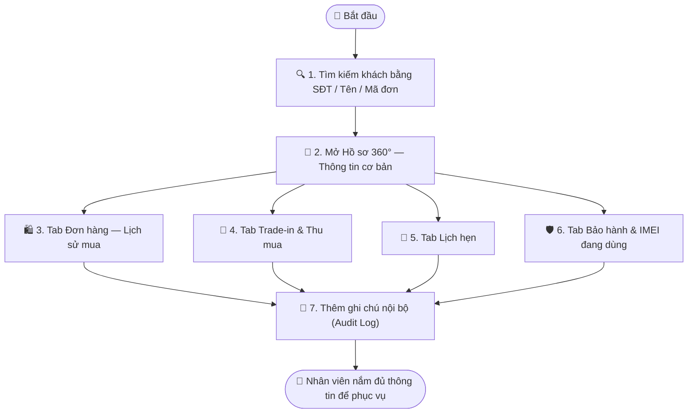

# Quy trình Nghiệp vụ: Single Customer View — Hồ sơ 360° Khách hàng

> **Mã quy trình:** Flow 16  
> **Mức độ phức tạp:** 3/5 (Khá phức tạp)  
> **Trọng tâm:** Nhân viên CRM mở một hồ sơ khách hàng duy nhất và thấy toàn bộ lịch sử tương tác: đơn hàng, Trade-in, Thu mua, lịch hẹn và bảo hành gộp lại trong một màn hình.  

---

## 1. Mục tiêu Quy trình
Giúp nhân viên bán hàng và CSKH hiểu ngay khách hàng đang nói chuyện là ai, họ đã mua gì, đang cần gì — không cần hỏi lại từ đầu.

## Sơ đồ Quy trình Trực quan (Flowchart)

## 2. Các Bên Tham gia (Actors)
- **Nhân viên Sales / CSKH**
- **CRM PhoneX**
- **Tất cả phân hệ nghiệp vụ**

## 3. Các Bước Chi tiết

### Bước 1: 🔍 Tìm kiếm Khách hàng
**Người thực hiện:** Nhân viên CSKH / Sales  
**Hành động:** Tìm khách bằng Số điện thoại, Họ tên hoặc mã đơn hàng. Hệ thống hiển thị danh sách gợi ý tức thời.  
**Kết quả:** Chính xác 1 hồ sơ khách hàng được tìm thấy.

### Bước 2: 👤 Xem Thông tin cơ bản
**Người thực hiện:** Nhân viên  
**Hành động:** Hiển thị: Họ tên, SĐT, địa chỉ, ngày tạo hồ sơ, ghi chú nội bộ. Chỉnh sửa thông tin nếu cần.  
**Kết quả:** Hồ sơ khách hàng đầy đủ và cập nhật.

### Bước 3: 🛍️ Xem lịch sử Đơn hàng
**Người thực hiện:** Nhân viên  
**Hành động:** Tất cả đơn hàng của khách (mua mới, Click & Collect), kèm trạng thái, sản phẩm, IMEI, giá và cửa hàng.  
**Kết quả:** Toàn cảnh hành vi mua hàng.

### Bước 4: 🔄 Xem lịch sử Trade-in & Thu mua
**Người thực hiện:** Nhân viên  
**Hành động:** Danh sách máy cũ khách đã bán/đổi, giá thu, kết quả kiểm định, ngày giao dịch.  
**Kết quả:** Hiểu giá trị máy cũ khách đã giao dịch.

### Bước 5: 📅 Xem lịch sử Lịch hẹn
**Người thực hiện:** Nhân viên  
**Hành động:** Tất cả lịch hẹn đã đặt (hoàn tất, hủy, đang chờ), loại dịch vụ và nhân viên phụ trách.  
**Kết quả:** Bức tranh tương tác đầy đủ theo thời gian.

### Bước 6: 🛡️ Xem danh sách Bảo hành đang có
**Người thực hiện:** Nhân viên  
**Hành động:** Thiết bị đang trong hạn bảo hành, IMEI, ngày mua, lịch sử sửa chữa và ticket đang xử lý.  
**Kết quả:** Nhân viên biết ngay thiết bị khách đang dùng.

### Bước 7: 📝 Thêm Ghi chú nội bộ
**Người thực hiện:** Nhân viên  
**Hành động:** Ghi note nội bộ về khách (khó tính, VIP, cần ưu tiên, v.v.) — chỉ nhân viên CRM thấy, khách không thấy.  
**Kết quả:** Ghi chú lưu vào Audit Log, có dấu thời gian và tên nhân viên.

## 4. Đồng bộ Website ↔ CRM
Single Customer View tổng hợp dữ liệu thời gian thực từ tất cả phân hệ: Đơn hàng, Trade-in, Thu mua, Lịch hẹn, Bảo hành. Mọi cập nhật tại bất kỳ phân hệ nào đều phản ánh ngay lập tức vào hồ sơ 360°.

## 5. Trường hợp Ngoại lệ

| Tình huống | Xử lý |
|-----------|-------|
| ⚠️ Khách dùng nhiều SĐT | Nhân viên tìm theo đơn hàng hoặc IMEI để ghép hồ sơ. |
| ⚠️ Dữ liệu khách bị trùng (do tạo thủ công) | Admin có quyền merge 2 hồ sơ thành 1, log đầy đủ. |
| ⚠️ Khách yêu cầu xem thông tin lưu về mình | Nhân viên có thể in PDF hồ sơ giao dịch cho khách. |

---
*Nguồn: Mục 21 — Tài liệu Yêu cầu Dự án PhoneX*
