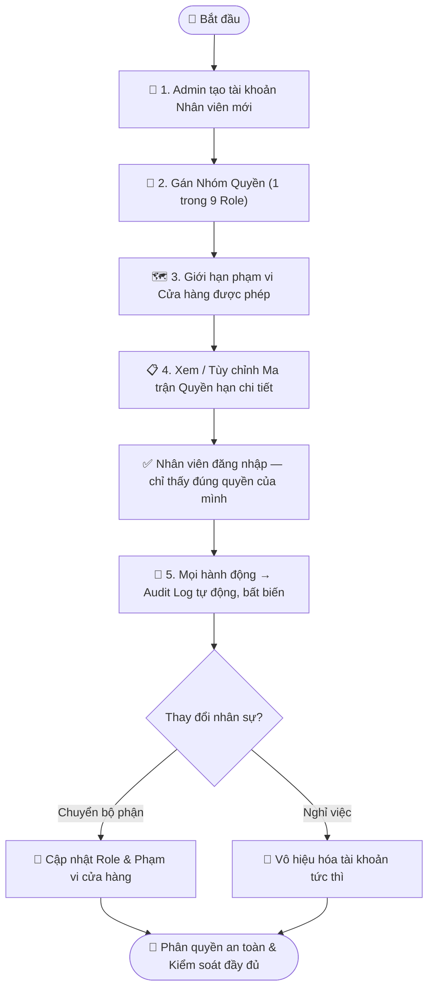

# Quy trình Nghiệp vụ: Phân quyền Nhân viên & Kiểm soát Truy cập (RBAC)

> **Mã quy trình:** Flow 17  
> **Mức độ phức tạp:** 4/5 (Phức tạp)  
> **Trọng tâm:** Quản trị viên cấu hình 9 nhóm quyền, gán nhân viên vào nhóm, giới hạn phạm vi dữ liệu theo cửa hàng và theo dõi mọi hành động qua Audit Log.  

---

## 1. Mục tiêu Quy trình
Đảm bảo mỗi nhân viên chỉ thấy và làm được đúng những gì thuộc quyền hạn của mình, bảo vệ dữ liệu kinh doanh nhạy cảm và ngăn ngừa thao túng giá/kho.

## Sơ đồ Quy trình Trực quan (Flowchart)

## 2. Các Bên Tham gia (Actors)
- **Quản trị viên (Admin)**
- **Ban Quản lý**
- **Nhân viên các bộ phận**
- **Hệ thống CRM**

## 3. Các Bước Chi tiết

### Bước 1: 🏢 Tạo Nhân viên mới
**Người thực hiện:** Quản trị viên (Admin)  
**Hành động:** Tạo tài khoản: Họ tên, SĐT/email, bộ phận, cửa hàng phụ trách. Cấp thông tin đăng nhập tạm thời.  
**Kết quả:** Tài khoản nhân viên được tạo với quyền mặc định tối thiểu.

### Bước 2: 🔐 Gán Nhóm Quyền (Role)
**Người thực hiện:** Quản trị viên / Ban Quản lý  
**Hành động:** Chọn 1 trong 9 nhóm quyền: Admin, Ban Quản lý, Quản lý Cửa hàng, Bán hàng, Thu mua, Kho, Kỹ thuật, CSKH, Kế toán.  
**Kết quả:** Nhân viên tự động được cấp/từ chối quyền theo matrix của nhóm.

### Bước 3: 🗺️ Giới hạn Phạm vi Cửa hàng
**Người thực hiện:** Quản trị viên  
**Hành động:** Gán nhân viên vào 1 hoặc nhiều cửa hàng cụ thể. Nhân viên chỉ xem được dữ liệu (đơn hàng, kho, lịch hẹn) của cửa hàng mình.  
**Kết quả:** Data isolation theo chi nhánh.

### Bước 4: 📋 Ma trận Quyền hạn chi tiết
**Người thực hiện:** Quản trị viên  
**Hành động:** Xem/chỉnh ma trận quyền: mỗi nhóm × mỗi module × hành động (Xem / Tạo / Sửa / Xóa / Phê duyệt / Xuất). Tùy chỉnh ngoại lệ cho cá nhân nếu cần.  
**Kết quả:** Bộ quyền hạn chính xác, tối thiểu hóa rủi ro.

### Bước 5: 📜 Audit Log — Nhật ký mọi hành động
**Người thực hiện:** Hệ thống tự động  
**Hành động:** Mọi hành động nhạy cảm được ghi lại tự động và không thể xóa: Sửa giá thu mua, xuất kho IMEI, hủy đơn, điều chỉnh phân quyền. Lưu: Ai — Khi nào — Làm gì — Dữ liệu cũ — Dữ liệu mới.  
**Kết quả:** Hồ sơ kiểm toán không thể bị giả mạo.

### Bước 6: 🔄 Thay đổi / Thu hồi Quyền
**Người thực hiện:** Quản trị viên / Ban Quản lý  
**Hành động:** Khi nhân viên chuyển bộ phận hoặc nghỉ việc: cập nhật role hoặc vô hiệu hóa tài khoản tức thì. Mọi phiên đăng nhập bị hủy ngay lập tức.  
**Kết quả:** Bảo mật tức thời — không có cửa sổ rủi ro.

## 4. Đồng bộ Website ↔ CRM
Ma trận phân quyền được áp dụng tức thì trên toàn hệ thống — không cần khởi động lại. Audit Log được ghi song song với mọi transaction, không ảnh hưởng đến hiệu năng hoạt động.

## 5. Trường hợp Ngoại lệ

| Tình huống | Xử lý |
|-----------|-------|
| ⚠️ Nhân viên cố truy cập module không có quyền | Hệ thống từ chối và ghi log cảnh báo. |
| ⚠️ Admin quên mật khẩu | Cơ chế khôi phục đặc biệt qua OTP + xác minh 2 bước. |
| ⚠️ Nhân viên kiêm nhiệm 2 vai trò | Gán 2 nhóm quyền cùng lúc — hệ thống tính hợp nhất quyền cao nhất. |

---
*Nguồn: Mục 31 – 32 — Tài liệu Yêu cầu Dự án PhoneX*
