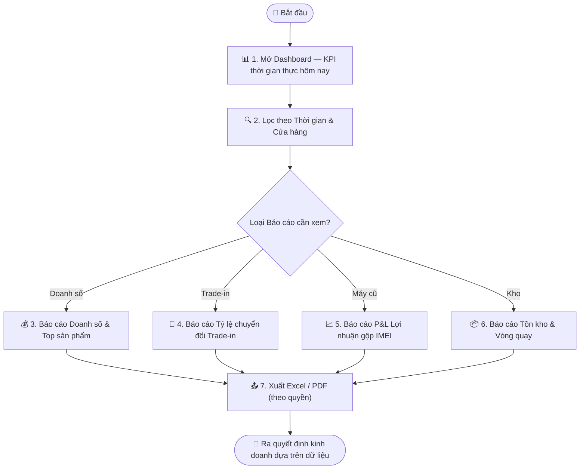

# Quy trình Nghiệp vụ: Báo cáo BI & Dashboard Quản trị

> **Mã quy trình:** Flow 18  
> **Mức độ phức tạp:** 4/5 (Phức tạp)  
> **Trọng tâm:** Ban Giám đốc và Quản lý truy cập hệ thống báo cáo thông minh để theo dõi doanh số, hiệu suất Trade-in, lợi nhuận máy cũ, tồn kho và hiệu quả bảo hành theo cửa hàng và khoảng thời gian.  

---

## 1. Mục tiêu Quy trình
Cung cấp góc nhìn tổng thể và chi tiết về sức khỏe kinh doanh, giúp lãnh đạo ra quyết định nhanh và chính xác dựa trên dữ liệu thực.

## Sơ đồ Quy trình Trực quan (Flowchart)

## 2. Các Bên Tham gia (Actors)
- **Ban Giám đốc**
- **Quản lý Cửa hàng**
- **Kế toán**
- **CRM PhoneX**

## 3. Các Bước Chi tiết

### Bước 1: 📊 Mở CRM Dashboard — Tổng quan ngày hôm nay
**Người thực hiện:** Quản lý / Ban Giám đốc  
**Hành động:** Dashboard hiển thị các KPI thời gian thực: Đơn hàng mới, Doanh thu, Yêu cầu Thu mua đang chờ, Trade-in đang xử lý, Lịch hẹn hôm nay, Máy nhập kho và Bảo hành đang xử lý.  
**Kết quả:** Bức tranh tổng thể trong vòng 5 giây.

### Bước 2: 🔍 Lọc theo Thời gian & Cửa hàng
**Người thực hiện:** Quản lý  
**Hành động:** Chọn khoảng thời gian (hôm nay / tuần / tháng / tùy chỉnh) và cửa hàng (toàn hệ thống hoặc từng chi nhánh). Dashboard lập tức cập nhật.  
**Kết quả:** Dữ liệu chính xác theo đúng phạm vi cần phân tích.

### Bước 3: 💰 Báo cáo Doanh số & Doanh thu
**Người thực hiện:** Ban Giám đốc / Kế toán  
**Hành động:** Xem doanh số theo kênh (Web / Cửa hàng / Click&Collect), theo sản phẩm, theo nhân viên. Biểu đồ xu hướng ngày/tuần.  
**Kết quả:** Top sản phẩm bán chạy, so sánh kỳ trước.

### Bước 4: 🔄 Báo cáo Trade-in & Thu mua
**Người thực hiện:** Trưởng phòng Kinh doanh  
**Hành động:** Tỷ lệ chuyển đổi hồ sơ Thu mua → Trade-in thành công; Giá trị máy thu vào trung bình; Số lượng Trade-in theo model và cửa hàng.  
**Kết quả:** Đánh giá hiệu quả chương trình thu đổi.

### Bước 5: 📦 Báo cáo Lợi nhuận Máy cũ (P&L IMEI)
**Người thực hiện:** Ban Giám đốc / Kế toán  
**Hành động:** Với từng IMEI đã bán: Giá nhập + Chi phí tân trang = Giá vốn; Giá bán - Giá vốn = Lợi nhuận gộp. Tổng hợp theo tháng/quý.  
**Kết quả:** P&L máy cũ chính xác đến từng chiếc.

### Bước 6: 🏪 Báo cáo Tồn kho & Vòng quay
**Người thực hiện:** Quản lý Kho / Ban Giám đốc  
**Hành động:** Tồn kho hiện tại theo cửa hàng, biến thể, trạng thái. Số ngày tồn trung bình (Days in Stock). Cảnh báo hàng tồn quá lâu.  
**Kết quả:** Tối ưu hóa vốn lưu động và tránh ứ hàng.

### Bước 7: 📤 Xuất báo cáo & Chia sẻ
**Người thực hiện:** Kế toán / Quản lý  
**Hành động:** Xuất báo cáo ra Excel/PDF. Lọc theo khoảng thời gian và cửa hàng trước khi xuất. Chỉ vai trò được phân quyền mới xuất được.  
**Kết quả:** File báo cáo sẵn sàng trình bày hoặc lưu trữ.

## 4. Đồng bộ Website ↔ CRM
Dashboard và tất cả báo cáo đều được tính toán từ dữ liệu thực tế của toàn hệ thống — không có độ trễ. Mỗi giao dịch (bán hàng, nhập kho, Trade-in hoàn tất) cập nhật ngay lập tức vào các chỉ số BI.

## 5. Trường hợp Ngoại lệ

| Tình huống | Xử lý |
|-----------|-------|
| ⚠️ Quản lý cửa hàng xem báo cáo chi nhánh khác | Hệ thống từ chối — chỉ Admin và Ban Giám đốc xem toàn bộ. |
| ⚠️ Dữ liệu lịch sử cần kiểm tra lại | Audit Log cho phép truy vết mọi thay đổi đã tạo ra số liệu. |
| ⚠️ Báo cáo xuất sai số do lỗi nhập liệu | Sửa tại nguồn dữ liệu — Dashboard tự động cập nhật lại. |

---
*Nguồn: Mục 20, 37 — Tài liệu Yêu cầu Dự án PhoneX*
