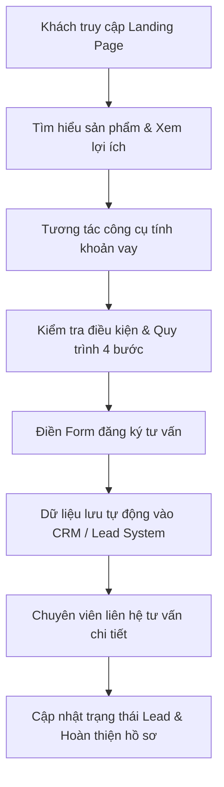

# TỔNG QUAN CHỨC NĂNG LANDING PAGE VAY TÀI CHÍNH
*Tài liệu đặc tả yêu cầu chức năng, trải nghiệm người dùng (UI/UX) và tiêu chuẩn kỹ thuật*

---

## 1. MỤC TIÊU VÀ ĐỊNH VỊ DỰ ÁN
- **Mục tiêu cốt lõi:** Xây dựng Landing Page chuyên biệt thu thập thông tin đăng ký tư vấn vay trực tuyến. Trang tập trung tối ưu tỷ lệ chuyển đổi, cung cấp thông tin minh bạch, rõ ràng, giúp khách hàng nắm bắt nhanh điều kiện và quy trình vay.
- **Hành động chuyển đổi chính (Primary Conversion):** Khách hàng hoàn tất và gửi biểu mẫu Đăng ký tư vấn vay tài chính.
- **Hệ thống Call-To-Action (CTA):**
  - **CTA Chính:** `ĐĂNG KÝ TƯ VẤN` / `ĐĂNG KÝ NGAY` (Màu cam `#F59E0B` nổi bật, kích thích hành động).
  - **CTA Phụ:** `GỌI TƯ VẤN` / `GỌI NGAY` (Kết nối hotline trực tiếp hỗ trợ tức thời).

---

## 2. PHONG CÁCH THIẾT KẾ (UI/UX) & BẢNG MÀU CHỦ ĐẠO
- **Định vị phong cách:** Chuẩn Fintech / Financial Services hiện đại, thanh lịch, tinh tế. Tạo dựng tối đa sự uy tín và an tâm; tuyệt đối tránh các hiệu ứng quá tải, giật gân mang hơi hướng “quảng cáo vay nóng”.
- **Nguyên tắc giao diện:** Khoảng trắng (whitespace) hợp lý giữa các section, biểu tượng (icon) đồng nhất, sử dụng hình ảnh chụp người thật hoặc minh họa đồ họa tài chính công nghệ cao.

### Bảng màu nhận diện đề xuất:
| Thành phần | Mã màu Hex | Ý nghĩa & Mục đích sử dụng |
| :--- | :--- | :--- |
| **Xanh dương đậm** | `#0B5BB5` | Màu chủ đạo thương hiệu, thể hiện sự tin cậy, vững chắc và bảo mật |
| **Cam điểm nhấn (CTA)** | `#F59E0B` | Màu chuyển đổi, làm nổi bật các nút hành động chính (Đăng ký / Nhận tư vấn) |
| **Chữ chính** | `#172033` | Màu văn bản chính trên nền sáng, đảm bảo độ tương phản cao, dễ đọc |
| **Nền nhẹ (Background)** | `#F4F8FD` | Phân tách các section nội dung, mang lại cảm giác dễ chịu, hiện đại |
| **Trắng tinh khiết** | `#FFFFFF` | Màu nền thẻ (card), form đăng ký và các khối nội dung trọng tâm |

---

## 3. CHI TIẾT CẤU TRÚC TRANG & TÍNH NĂNG CÁC SECTION

### 3.1. Header (Thanh điều hướng Sticky)
- **Vị trí & Cơ chế:** Cố định ở đầu trang (Sticky Header) khi cuộn chuột, thiết kế gọn gàng, tinh tế.
- **Bên trái:** Logo thương hiệu sắc nét (kèm liên kết về đầu trang).
- **Chính giữa (Menu):** Trang chủ | Sản phẩm vay | Điều kiện | Quy trình | FAQ.
- **Bên phải:** Số Hotline tư vấn trực tiếp và nút bấm `ĐĂNG KÝ NGAY`.

### 3.2. Hero Section (Khu vực chuyển đổi trọng tâm)
- **Bố cục:** Dạng chia đôi (Split layout): Nội dung truyền thông bên trái – Form đăng ký bên phải.
- **Nội dung bên trái:**
  - Tiêu đề H1 nổi bật: **“Vay Tài Chính Nhanh – Đăng Ký Trực Tuyến”**.
  - Mô tả giải pháp tinh gọn, nêu rõ vai trò hỗ trợ kết nối tư vấn.
  - Cụm 4 lợi ích nhanh: `✓ Đăng ký trực tuyến` | `✓ Quy trình đơn giản` | `✓ Tư vấn nhanh chóng` | `✓ Thông tin minh bạch`.
  - Nút CTA phụ gọi hotline ngay.
- **Form đăng ký bên phải:** Đặt ngay trong tầm mắt đầu trang (Above the Fold) giúp tối ưu tỷ lệ chuyển đổi.

### 3.3. Form Đăng Ký Tư Vấn Vay (Lead Capture)
- **Tiêu đề Form:** **“Đăng Ký Tư Vấn Khoản Vay”**
- **Các trường thông tin:**
  - Họ và tên *(Text input - Bắt buộc)*.
  - Số điện thoại *(Tel input - Validate số hợp lệ)*.
  - Số tiền muốn vay *(Dropdown/Radio: 10 triệu, 20 triệu, 30 triệu, 50 triệu, Trên 50 triệu)*.
  - Thời hạn mong muốn *(Dropdown/Radio: 6 tháng, 12 tháng, 18 tháng, 24 tháng, Khác)*.
  - Checkbox điều khoản: *“Tôi đồng ý với Chính sách bảo mật và việc xử lý thông tin để phục vụ yêu cầu tư vấn.”* (Bắt buộc).
- **CTA gửi Form:** `NHẬN TƯ VẤN`.
- **Thông báo thành công:** *“Cảm ơn bạn đã đăng ký. Bộ phận tư vấn sẽ liên hệ để trao đổi thêm thông tin.”*
> **Nguyên tắc Bảo mật Form:** Tuyệt đối KHÔNG yêu cầu khách hàng cung cấp số CCCD, mật khẩu ngân hàng, mã OTP hay các thông tin tài sản nhạy cảm tại bước đăng ký ban đầu.

### 3.4. Thanh Thông Tin Nhanh (Value Proposition Bar)
Đặt ngay dưới Hero Section gồm 4 khối tóm tắt lợi thế cạnh tranh:
1. **Đăng ký Online:** Tiến hành đăng ký nhu cầu 100% trực tuyến, tiết kiệm thời gian.
2. **Quy trình rõ ràng:** Các bước thẩm định và thủ tục được trình bày dễ hiểu, minh bạch.
3. **Tư vấn nhanh:** Đội ngũ chuyên viên kết nối giải đáp mọi băn khoăn về khoản vay.
4. **Bảo mật thông tin:** Cam kết bảo mật dữ liệu theo chính sách quyền riêng tư công bố.

### 3.5. Danh Mục Sản Phẩm Vay (Card Grid)
- **Tiêu đề:** **“Giải Pháp Tài Chính Phù Hợp Với Nhu Cầu Của Bạn”**
- **Thiết kế:** Dạng thẻ (Card) gồm 3 gói chính. Mỗi thẻ hiển thị: Hạn mức tham khảo, thời hạn, điều kiện cốt lõi và nút CTA:
  - **Vay tiêu dùng:** Phục vụ chi tiêu mua sắm cá nhân, gia đình. CTA: `TÌM HIỂU`.
  - **Vay tín chấp:** Đăng ký dựa trên hồ sơ uy tín, không cần thế chấp tài sản. CTA: `ĐĂNG KÝ TƯ VẤN`.
  - **Vay theo thu nhập:** Dành cho khách hàng có nguồn lương/thu nhập định kỳ ổn định. CTA: `KIỂM TRA ĐIỀU KIỆN`.
> **Lưu ý dữ liệu sản phẩm:** Toàn bộ thông số về hạn mức, lãi suất, phí và kỳ hạn phải lấy từ sản phẩm thực tế, không tự bịa đặt thông số quảng cáo sai sự thật.

### 3.6. Công Cụ Ước Tính Khoản Vay (Interactive Loan Calculator)
- **Tiêu đề:** **“Ước Tính Khoản Vay Của Bạn”**
- **Thao tác tương tác:** 2 thanh trượt trực quan (Slider):
  - *Số tiền muốn vay:* Từ 10 triệu đến 100 triệu VNĐ.
  - *Thời hạn vay:* Từ 6 tháng đến 36 tháng.
- **Kết quả hiển thị:** Khoản thanh toán ước tính: **`x.xxx.xxx VNĐ/tháng`** (nhảy số động theo công thức dư nợ giảm dần hoặc niên kim).
- **CTA:** `NHẬN TƯ VẤN CHI TIẾT`.
> **Disclaimer pháp lý:** *“Kết quả chỉ mang tính tham khảo. Khoản vay, lãi suất, phí và số tiền thanh toán thực tế phụ thuộc vào sản phẩm, hồ sơ và kết quả xét duyệt của đơn vị cung cấp.”*

### 3.7. Điều Kiện Đăng Ký (Checklist)
- **Tiêu đề:** **“Điều Kiện Đăng Ký Cơ Bản”**
- **Trình bày:** Checklist trực quan:
  - `✓` Đáp ứng độ tuổi theo quy định của từng gói sản phẩm vay.
  - `✓` Có giấy tờ tùy thân hợp lệ (CCCD/CMND còn thời hạn).
  - `✓` Có số điện thoại di động chính chủ đang hoạt động.
  - `✓` Có nguồn thu nhập phù hợp nếu sản phẩm cụ thể yêu cầu.
  - `✓` Đáp ứng các tiêu chí xét duyệt tín dụng của đơn vị cho vay.

### 3.8. Quy Trình Đăng Ký 4 Bước (Process Timeline)
- **Tiêu đề:** **“Đăng Ký Đơn Giản Với 4 Bước”**
- **Timeline:**
  1. **Bước 1 - Đăng ký thông tin:** Nhập nhu cầu khoản vay qua Form trực tuyến.
  2. **Bước 2 - Nhận tư vấn:** Chuyên viên liên hệ trực tiếp, tư vấn gói giải pháp và lãi suất phù hợp.
  3. **Bước 3 - Hoàn thiện hồ sơ:** Chuẩn bị các hồ sơ cần thiết theo hướng dẫn của tư vấn viên.
  4. **Bước 4 - Nhận kết quả:** Đơn vị cung cấp tiến hành thẩm định và thông báo kết quả giải ngân.

### 3.9. Lý Do Chọn Chúng Tôi (Why Choose Us)
Gồm 6 khối lợi thế cạnh tranh với icon hiện đại:
- **Thông tin rõ ràng:** Điều kiện, thủ tục minh bạch, công khai.
- **Đăng ký thuận tiện:** Hỗ trợ nộp yêu cầu trực tuyến 24/7.
- **Tư vấn hỗ trợ:** Chuyên viên tận tâm giải đáp mọi thắc mắc.
- **Quy trình đơn giản:** Tối giản các bước, tiết kiệm thời gian.
- **Bảo mật thông tin:** Quy trình xử lý dữ liệu an toàn theo quy định.
- **Minh bạch tuyệt đối:** Đầy đủ thông tin về phí, lãi suất trước khi quyết định.

### 3.10. Câu Hỏi Thường Gặp (FAQ Accordion)
Cấu trúc dạng Accordion mở/đóng mượt mà cho 6 thắc mắc then chốt:
1. **Tôi có thể đăng ký vay bao nhiêu?** → Hạn mức phụ thuộc vào từng gói sản phẩm, điều kiện hồ sơ và kết quả xét duyệt của đơn vị cung cấp.
2. **Thời hạn vay kéo dài bao lâu?** → Thời hạn linh hoạt từ 6 đến 36 tháng tùy theo từng gói vay cụ thể.
3. **Đăng ký tư vấn có mất phí không?** → Đăng ký tư vấn hoàn toàn miễn phí. Mọi khoản phí liên quan đến khoản vay (nếu có) được công bố minh bạch.
4. **Sau bao lâu tôi nhận được kết quả?** → Chuyên viên sẽ liên hệ trong giờ làm việc ngay sau khi nhận thông tin đăng ký.
5. **Đăng ký có chắc chắn được duyệt vay?** → Không. Việc gửi form giúp tiếp nhận nhu cầu tư vấn; kết quả phê duyệt phụ thuộc vào thẩm định hồ sơ thực tế.
6. **Thông tin cá nhân có được bảo mật không?** → Toàn bộ thông tin được bảo vệ theo Chính sách quyền riêng tư và quy định bảo vệ dữ liệu hiện hành.

### 3.11. CTA Cuối Trang & Footer
- **CTA Chốt Trang:** Khối kêu gọi nổi bật trước Footer: *“Bạn Đang Có Nhu Cầu Tìm Hiểu Khoản Vay?”* kèm 2 nút `ĐĂNG KÝ TƯ VẤN` và `GỌI TƯ VẤN`.
- **Footer Pháp lý & Doanh nghiệp:**
  - *Thông tin đơn vị vận hành:* Tên doanh nghiệp, Mã số thuế, Địa chỉ, Hotline, Email liên hệ.
  - *Menu điều hướng phụ:* Sản phẩm vay, Điều kiện, Quy trình, FAQ, Liên hệ.
  - *Liên kết pháp lý:* Chính sách bảo mật, Điều khoản sử dụng, Chính sách xử lý dữ liệu cá nhân.
  - *Tuyên bố vai trò:* Nêu rõ website đóng vai trò nền tảng kết nối/tư vấn độc lập, không trực tiếp cấp tín dụng (nếu website đóng vai trò trung gian).

---

## 4. YÊU CẦU THIẾT KẾ ĐA THIẾT BỊ (RESPONSIVE & MOBILE-FIRST)
- **Chiến lược Mobile First:** Thiết kế layout chuyên biệt cho di động, không đơn thuần là thu nhỏ Desktop. Khung nhìn chuẩn: `390 × 844 px`.
- **Thứ tự ưu tiên Mobile:** Logo → H1 & Mô tả → 3-4 Lợi ích → CTA → Form đăng ký → Card 1 cột → FAQ Accordion.
- **Thanh tiện ích cố định (Bottom Sticky Bar):** Trên Mobile, luôn ghim thanh điều hướng ở mép dưới màn hình gồm 2 nút: `GỌI TƯ VẤN` | `ĐĂNG KÝ`.
- **Quy chuẩn Breakpoints:**
  - Desktop: `1440px`
  - Tablet / iPad: `768px – 1024px`
  - Mobile: `375px – 430px`
- **Tiêu chuẩn trải nghiệm:** Tuyệt đối không tràn ngang (Horizontal overflow), nút bấm đủ lớn dễ chạm (Tap target >= 44x44px), khoảng cách các khối vừa phải.

--- 

## 5. YÊU CẦU KỸ THUẬT, TRACKING & SEO
- **Xử lý Form & Dữ liệu:** Validate trường dữ liệu real-time, tích hợp Honeypot/reCAPTCHA chống spam. Dữ liệu Lead được đẩy ngay vào CRM hoặc lưu cơ sở dữ liệu qua API/Webhook.
- **Đo lường & Phân tích (Analytics):** Cài đặt Google Tag Manager (GTM) và Google Analytics 4 (GA4). Theo dõi toàn diện các sự kiện hành vi:
  - Click CTA (Header, Hero, Footer, Sticky Bar).
  - Bắt đầu điền form (`form_start`).
  - Gửi form đăng ký (`form_submit`).
  - Chuyển đổi thành công (`lead_conversion_success`).
- **Hiệu năng trang (Core Web Vitals):** Tối ưu LCP < 2.5s, INP < 200ms, CLS < 0.1. Tự động nén ảnh chuẩn WebP/AVIF, kích hoạt Lazy Loading, nén tài nguyên JS/CSS.
- **Tối ưu hóa SEO On-page:** Đảm bảo duy nhất 1 thẻ H1, phân cấp H2/H3 ngữ nghĩa, Meta Title & Description hấp dẫn, Open Graph mạng xã hội, dữ liệu có cấu trúc (`Schema JSON-LD FinancialProduct` / `Organization`). Toàn bộ nội dung sản phẩm phải là HTML text, không đưa chữ vào ảnh.

---

## 6. NGUYÊN TẮC NỘI DUNG & TUÂN THỦ PHÁP LÝ
- **Tuyệt đối không cam kết sai lệch:** Nghiêm cấm các phát ngôn gây hiểu nhầm hoặc vi phạm quy định quảng cáo tài chính:
  - `✗` “100% duyệt vay”
  - `✗` “Chắc chắn có tiền”
  - `✗` “Ai cũng vay được / Bao đậu nợ xấu”
  - `✗` “Không cần xét duyệt”
  - `✗` “Lãi suất 0%” (trừ khi có chương trình ưu đãi thực tế có điều kiện đính kèm).
- **Tính trung thực & Minh bạch:** Mọi dữ liệu về hạn mức, lãi suất, phí phát sinh, kỳ hạn và đơn vị tài trợ phải trích dẫn chính xác từ chính sách sản phẩm được phê duyệt.

---

## 7. SƠ ĐỒ LUỒNG CHUYỂN ĐỔI CHÍNH (USER JOURNEY)

