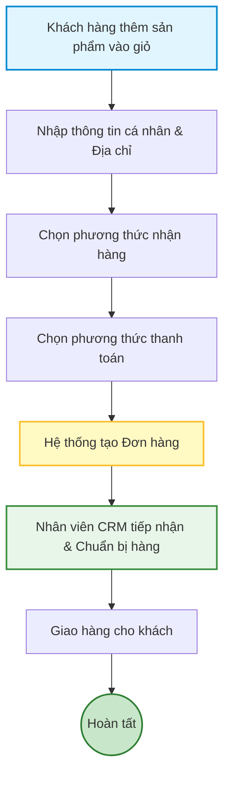

# 01 - Quy trình Đặt hàng trực tuyến

Quy trình này cho phép khách hàng mua sắm nhanh chóng mà không cần bắt buộc tạo tài khoản (Guest Checkout).

1. **Khách hàng thêm sản phẩm vào giỏ hàng:** Chọn màu sắc, dung lượng và số lượng.
2. **Nhập thông tin giao hàng:** Họ tên, Số điện thoại, Địa chỉ nhận hàng.
3. **Chọn phương thức nhận hàng:** Giao hàng tận nhà (Hỏa tốc / Tiêu chuẩn) hoặc Nhận tại Showroom.
4. **Chọn phương thức thanh toán:** Tiền mặt (COD), Chuyển khoản, Thẻ tín dụng, Ví điện tử hoặc Trả góp.
5. **Hệ thống tạo đơn hàng:** Chuyển đơn về CRM nội bộ và hiển thị thông báo thành công cho khách hàng.
6. **Nhân viên xử lý đơn (CRM):** Tiếp nhận, xác nhận cọc, chuẩn bị hàng và xuất kho.
7. **Giao hàng và Hoàn tất:** Khách hàng nhận máy và hệ thống cập nhật trạng thái hoàn tất.

## Sơ đồ Quy trình

