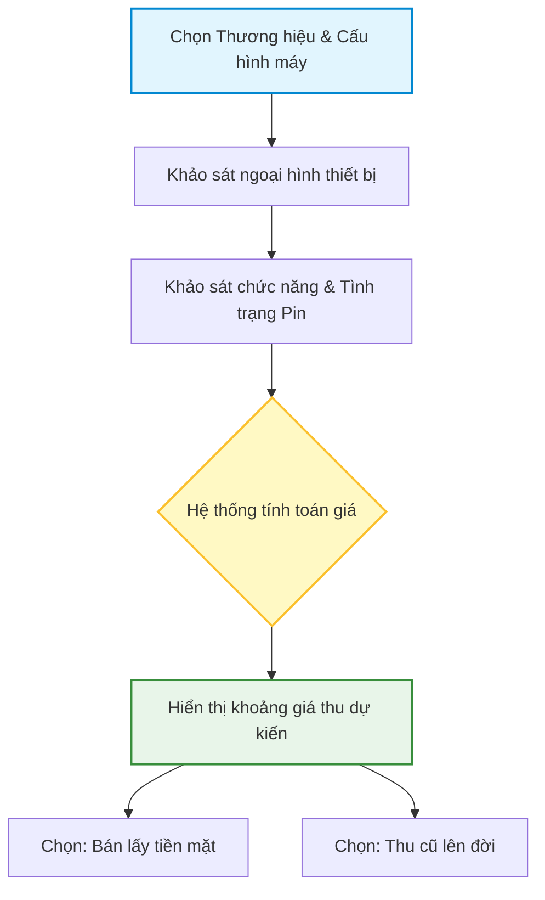

# 02 - Quy trình Định giá máy cũ trực tuyến

Khách hàng tự đánh giá tình trạng thiết bị cũ của mình để xem mức giá thu mua dự kiến từ hệ thống.

1. **Khách hàng chọn cấu hình máy:** Chọn Hãng, Dòng máy, Phiên bản dung lượng.
2. **Khảo sát ngoại hình:** Chọn mức độ mới của máy (Đẹp 99%, Cấn nhẹ, Trầy xước...).
3. **Khảo sát chức năng & Pin:** Khai báo tình trạng Camera, Màn hình, FaceID, Tỷ lệ Pin.
4. **Hệ thống tính toán giá:** Dựa trên bảng giá gốc và tỷ lệ trừ lỗi, hệ thống hiển thị khoảng giá thu dự kiến.
5. **Lựa chọn tiếp theo:** Khách hàng có thể chọn Bán lấy tiền mặt hoặc Thu cũ đổi mới lên đời.

## Sơ đồ Quy trình

