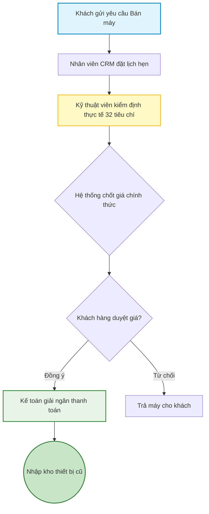

# 03 - Quy trình Bán máy cũ lấy tiền mặt

Sau khi định giá xong, khách hàng muốn bán lại máy cũ cho cửa hàng để lấy tiền mặt.

1. **Gửi yêu cầu bán máy:** Khách hàng để lại thông tin từ kết quả định giá.
2. **Tiếp nhận & Đặt lịch (CRM):** Nhân viên xác nhận lịch hẹn (tại cửa hàng hoặc thu mua tận nơi).
3. **Kỹ thuật viên kiểm định:** Đánh giá thực tế 32 tiêu chí (Ngoại hình, chức năng, phần cứng).
4. **Hệ thống chốt giá chính thức:** Tính toán lại mức giá dựa trên kết quả kiểm định thực tế.
5. **Khách hàng duyệt giá:** Khách hàng đồng ý với mức giá thu mua cuối cùng.
6. **Giải ngân & Nhập kho:** Kế toán thanh toán tiền cho khách, hệ thống tự động tạo mã IMEI và nhập kho máy cũ.

## Sơ đồ Quy trình

