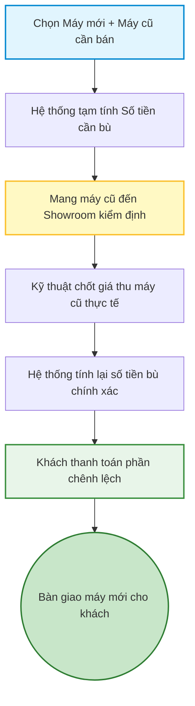

# 04 - Quy trình Thu cũ đổi mới (Trade-in)

Kết hợp giữa việc khách hàng bán máy cũ và mua máy mới, kèm theo các ưu đãi trợ giá đặc quyền.

1. **Khách hàng chọn Combo:** Chọn máy mới muốn mua và máy cũ muốn bán.
2. **Xem dự toán chi phí:** Hệ thống tính toán Số tiền bù = [Giá máy mới] - [Giá thu máy cũ] - [Trợ giá Trade-in].
3. **Bàn giao máy cũ:** Khách hàng mang máy cũ đến cửa hàng để kiểm định thực tế.
4. **Chốt mức giá cuối cùng (CRM):** Kỹ thuật viên kiểm tra xong, chốt giá máy cũ và số tiền bù thực tế.
5. **Thanh toán phần chênh lệch:** Khách hàng thanh toán số tiền còn lại (Tiền mặt hoặc Trả góp).
6. **Bàn giao máy mới:** Nhân viên giao máy mới cho khách, kết thúc quy trình Trade-in.

## Sơ đồ Quy trình

