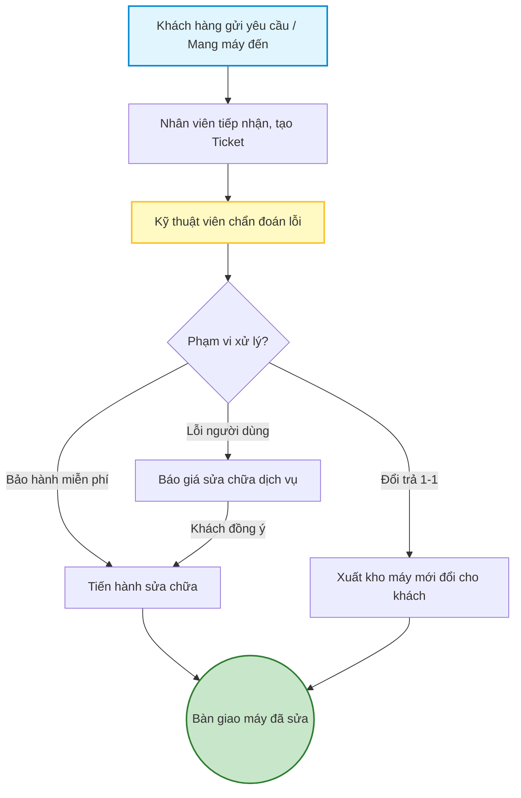

# 05 - Quy trình Xử lý Bảo hành & Đổi trả

Quy trình hỗ trợ khách hàng khi sản phẩm gặp lỗi trong quá trình sử dụng.

1. **Khách hàng yêu cầu hỗ trợ:** Tạo Ticket trực tuyến trên web hoặc mang máy ra quầy.
2. **Tiếp nhận thiết bị (CRM):** Nhân viên tạo phiếu tiếp nhận, ghi nhận tình trạng lỗi khách báo.
3. **Kỹ thuật chẩn đoán:** Kiểm tra nguyên nhân, xác định lỗi thuộc phạm vi bảo hành hay do người dùng.
4. **Đề xuất phương án:** 
   - Đổi máy mới (Nếu lỗi do NSX trong x ngày đầu).
   - Sửa chữa miễn phí (Trong hạn bảo hành).
   - Báo giá sửa chữa (Nếu ngoài bảo hành hoặc lỗi do người dùng).
5. **Tiến hành xử lý:** Kỹ thuật viên sửa chữa, thay thế linh kiện và cập nhật lịch sử.
6. **Bàn giao lại thiết bị:** Hoàn tất phiếu bảo hành và trả máy cho khách hàng.

## Sơ đồ Quy trình

