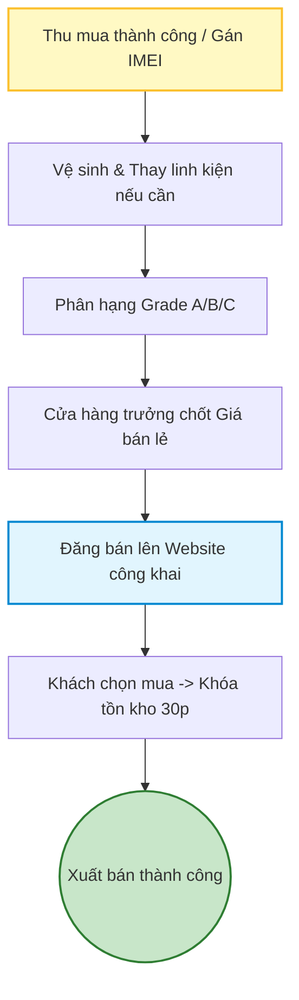

# 06 - Vòng đời quản lý thiết bị cũ (Từ thu mua đến bán)

Đây là quy trình nội bộ quản lý chặt chẽ từng chiếc điện thoại cũ như một thực thể độc lập từ lúc nhập vào cho đến khi xuất bán ra.

1. **Nhập kho ban đầu:** Sau khi thu mua, máy được tạo hồ sơ với mã IMEI duy nhất.
2. **Kỹ thuật chuyên sâu:** Kiểm tra lại toàn diện, vệ sinh máy, thay thế linh kiện hao mòn (như thay Pin nếu cần).
3. **Phân hạng Grade:** Căn cứ tình trạng cuối cùng, gán loại (Grade A/B/C) cho thiết bị.
4. **Định giá bán (Pricing):** Quản lý duyệt giá bán lẻ dựa trên [Giá vốn thu mua] + [Chi phí sửa chữa/Linh kiện].
5. **Sẵn sàng kinh doanh:** Thiết bị được tự động đẩy lên Website với hình ảnh thực tế và số Serial cụ thể.
6. **Khóa tồn kho tạm thời:** Khi có khách thêm máy vào giỏ và thanh toán, máy bị khóa không cho người khác mua.
7. **Xuất kho hoàn tất:** Khách hàng thanh toán thành công, máy được xuất kho và chuyển sang trạng thái đã bán.

## Sơ đồ Quy trình

