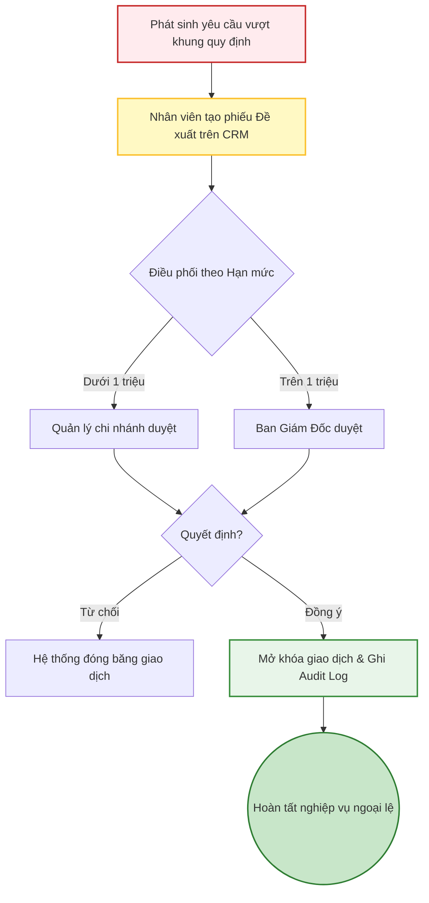

# 07 - Quy trình Phê duyệt tập trung

Quản lý các nghiệp vụ nhạy cảm hoặc vượt khung quy định tiêu chuẩn, đòi hỏi cấp quản lý can thiệp.

1. **Phát sinh ngoại lệ:** 
   - Khách VIP đòi chiết khấu cao hơn quy định.
   - Thu mua máy cũ giá cao hơn trần hệ thống do máy quá đẹp.
   - Yêu cầu hoàn tiền mặt giá trị lớn.
2. **Nhân viên tạo Đề xuất:** Điền lý do, đính kèm hình ảnh minh chứng trên CRM.
3. **Hệ thống điều phối (Workflow):** Đẩy thông báo duyệt lên cấp Quản lý hoặc Giám đốc tùy theo hạn mức.
4. **Kiểm duyệt:** Cấp quản lý xem xét hồ sơ và quyết định Duyệt hoặc Từ chối.
5. **Thực thi:** Nếu được duyệt, hệ thống mở khóa tính năng để nhân viên hoàn tất giao dịch. Mọi thao tác được lưu vết vào Audit Log.

## Sơ đồ Quy trình

